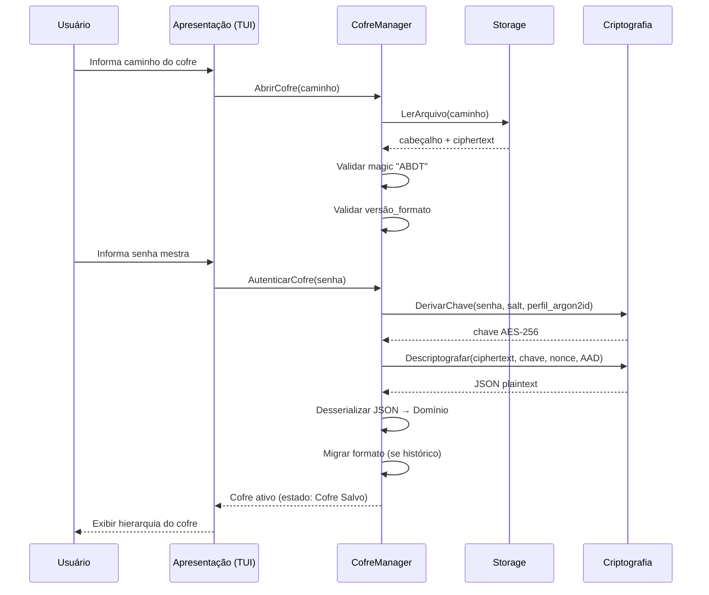
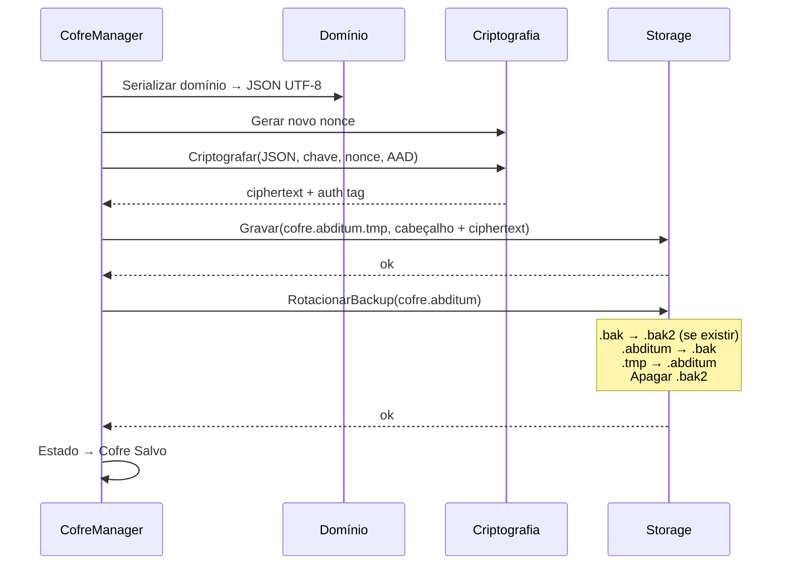
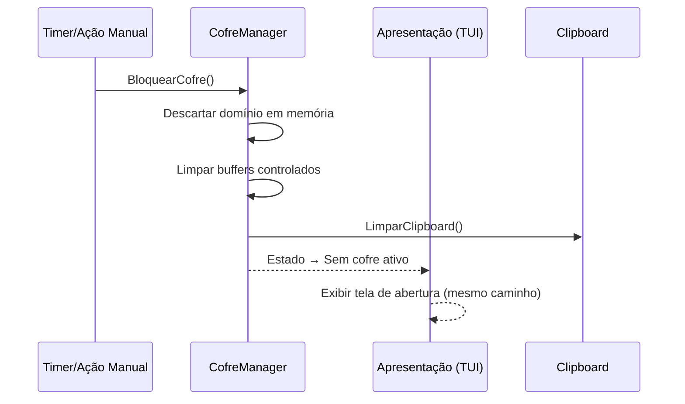
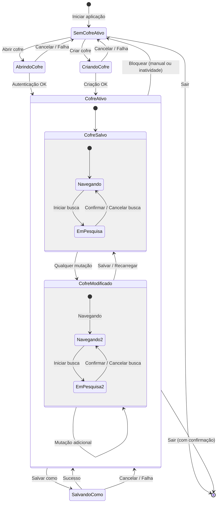

# Documento de Arquitetura de Software (SAD) — Abditum

| Item              | Detalhe                                   |
|-------------------|-------------------------------------------|
| **Projeto**       | Abditum — Cofre de Senhas Portátil        |
| **Versão**        | 1.0                                       |
| **Data**          | 2026-03-25                                |

---

## 1. Introdução

### 1.1. Propósito

Este documento descreve a arquitetura de software do Abditum, um cofre de senhas portátil, seguro e offline, implementado como binário único Go com interface TUI. Destina-se a desenvolvedores e revisores que precisam compreender as decisões estruturais, camadas, dependências e fluxos do sistema.

### 1.2. Escopo

Cobre a arquitetura da versão 1.0 do Abditum: criptografia, persistência, domínio, interface TUI e estratégia de testes.

### 1.3. Referências

| Documento                     | Arquivo                     |
|-------------------------------|-----------------------------|
| Descrição da Aplicação        | `descricao.md`              |
| Documento de Visão            | `docs/RUP/visao.md`         |
| SRS                           | `docs/RUP/srs.md`           |
| Modelo de Domínio             | `docs/RUP/modelo-dominio.md`|
| Modelo de Dados / Payload     | `docs/RUP/modelo-dados.md`  |

---

## 2. Restrições Arquiteturais

| #  | Restrição                                                                                          |
|----|-----------------------------------------------------------------------------------------------------|
| C1 | Binário único executável — sem dependência de runtime, instalação ou arquivos externos               |
| C2 | Dados 100% autossuficientes — configurações, modelos e segredos dentro do próprio `.abditum`        |
| C3 | Offline-only — sem comunicação de rede em nenhum cenário                                            |
| C4 | Multiplataforma — Windows, macOS e Linux (64-bit)                                                   |
| C5 | Zero Knowledge — impossibilidade de recuperação de dados sem a senha mestra                         |
| C6 | Interface Terminal (TUI) — sem GUI nativa, sem dependência de servidor gráfico                      |
| C7 | Privacidade absoluta — nenhum dado sensível em logs (stdout/stderr)                                 |

---

## 3. Visão de Casos de Uso Arquiteturalmente Significativos

Os seguintes casos de uso dirigem as decisões arquiteturais:

| Caso de Uso                             | Impacto Arquitetural                                          |
|-----------------------------------------|---------------------------------------------------------------|
| Criar/Abrir cofre                       | Camada de criptografia, derivação de chave, formato binário   |
| Salvar cofre (atômico)                  | Estratégia .tmp/.bak/.bak2, integridade transacional          |
| Bloquear cofre (manual/inatividade)     | Limpeza de memória, reinício de sessão, timers                |
| Navegar hierarquia                      | Modelo recursivo, leitura imutável, projeções de pastas virtuais |
| Buscar segredos                         | Varredura in-memory, exclusão de campos sensíveis             |
| Importar/Exportar JSON plain text       | Serialização do domínio, regras de merge                      |
| Copiar campo / Limpar clipboard         | Interação com OS, timers, segurança de dados transitórios     |

---

## 4. Visão Lógica — Camadas

### 4.1. Diagrama de Camadas

```
┌─────────────────────────────────────────────────────────────┐
│                     APRESENTAÇÃO (TUI)                      │
│   Bubble Tea (tea.Model, tea.Cmd, tea.Msg)                  │
│   Telas · Painéis · Componentes · Barra de Status           │
├─────────────────────────────────────────────────────────────┤
│                     APLICAÇÃO (Manager)                     │
│   CofreManager · SegredoManager · PastaManager              │
│   ModeloManager · ConfigManager · BuscaManager               │
│   Orquestração de fluxos · Regras de negócio                 │
├─────────────────────────────────────────────────────────────┤
│                     DOMÍNIO (Entidades)                     │
│   Cofre · Segredo · Pasta · ModeloSegredo                   │
│   CampoSegredo · CampoModeloSegredo · Configuracoes         │
│   Enums (TipoCampo) · Value Objects (NanoID)                │
├─────────────────────────────────────────────────────────────┤
│                     INFRAESTRUTURA                          │
│   ┌──────────────────┐  ┌─────────────────────────────────┐ │
│   │   Criptografia    │  │   Armazenamento (Storage)      │ │
│   │  AES-256-GCM      │  │  Leitura/Escrita .abditum      │ │
│   │  Argon2id          │  │  Salvamento atômico            │ │
│   │  NanoID            │  │  Rotação de backup             │ │
│   └──────────────────┘  └─────────────────────────────────┘ │
│   ┌──────────────────┐  ┌─────────────────────────────────┐ │
│   │   Clipboard       │  │   Timer / Scheduler            │ │
│   │  OS clipboard API │  │  Inatividade · Reocultação     │ │
│   │  Limpeza auto     │  │  Limpeza clipboard             │ │
│   └──────────────────┘  └─────────────────────────────────┘ │
└─────────────────────────────────────────────────────────────┘
```

### 4.2. Responsabilidades por Camada

| Camada          | Responsabilidades                                                                                 |
|-----------------|---------------------------------------------------------------------------------------------------|
| **Apresentação**| Renderização TUI, captura de input (teclado/mouse), navegação de painéis, feedback visual          |
| **Aplicação**   | Orquestração de casos de uso, aplicação de regras de negócio, gerenciamento de estado do cofre     |
| **Domínio**     | Definição de entidades e value objects, invariantes estruturais, tipos                             |
| **Infraestrutura** | Criptografia, derivação de chave, leitura/escrita de arquivos, clipboard, temporizadores       |

### 4.3. Regras de Dependência

```
Apresentação → Aplicação → Domínio ← Infraestrutura
                              ↑
                     Infraestrutura
```

- **Apresentação** depende de **Aplicação** (nunca acessa Domínio ou Infra diretamente).
- **Aplicação** depende de **Domínio** e de interfaces definidas no Domínio.
- **Infraestrutura** implementa interfaces definidas no Domínio (Dependency Inversion).
- **Domínio** não depende de nenhuma outra camada.

---

## 5. Visão de Processos

### 5.1. Fluxo de Abertura de Cofre



### 5.2. Fluxo de Salvamento Atômico



### 5.3. Fluxo de Bloqueio



---

## 6. Visão de Implantação

### 6.1. Topologia

```
┌──────────────────────────────────────────────────────────┐
│                 MÁQUINA DO USUÁRIO                       │
│                                                          │
│  ┌─────────────┐     ┌──────────────────────────────┐    │
│  │  abditum     │     │  cofre.abditum               │    │
│  │  (binário    │◄───►│  (arquivo criptografado)     │    │
│  │   único Go)  │     │  cofre.abditum.bak           │    │
│  └─────────────┘     └──────────────────────────────┘    │
│                                                          │
│  Sem rede · Sem cloud · Sem servidor                     │
└──────────────────────────────────────────────────────────┘
```

### 6.2. Plataformas Alvo

| Plataforma    | Arquitetura | Compilação                        |
|---------------|-------------|-----------------------------------|
| Windows       | amd64       | `GOOS=windows GOARCH=amd64`      |
| macOS         | amd64/arm64 | `GOOS=darwin GOARCH=amd64/arm64` |
| Linux         | amd64       | `GOOS=linux GOARCH=amd64`        |

### 6.3. Artefatos de Implantação

| Artefato                   | Descrição                                         |
|----------------------------|----------------------------------------------------|
| `abditum` / `abditum.exe` | Binário único executável — a própria aplicação      |
| `*.abditum`                | Arquivo de cofre criptografado                      |
| `*.abditum.bak`            | Backup do salvamento anterior                       |
| `*.abditum.tmp`            | Temporário durante salvamento atômico (transitório) |
| `*.abditum.bak2`           | Backup temporário de rotação (transitório)          |

---

## 7. Visão de Implementação — Estrutura de Pacotes

### 7.1. Organização Proposta

```
abditum/
├── cmd/
│   └── abditum/
│       └── main.go              # Ponto de entrada
├── internal/
│   ├── domain/                  # Camada de Domínio
│   │   ├── cofre.go             # Entidade Cofre (raiz agregada)
│   │   ├── segredo.go           # Entidade Segredo + CampoSegredo
│   │   ├── pasta.go             # Entidade Pasta
│   │   ├── modelo.go            # Entidade ModeloSegredo + CampoModeloSegredo
│   │   ├── configuracoes.go     # Value Object Configuracoes
│   │   ├── tipos.go             # Enums (TipoCampo), NanoID
│   │   └── interfaces.go       # Interfaces de infraestrutura
│   ├── application/             # Camada de Aplicação (Managers)
│   │   ├── cofre_manager.go     # Orquestração do ciclo de vida do cofre
│   │   ├── segredo_manager.go   # Operações sobre segredos
│   │   ├── pasta_manager.go     # Operações sobre pastas
│   │   ├── modelo_manager.go    # Operações sobre modelos
│   │   ├── busca_manager.go     # Busca sequencial em memória
│   │   └── config_manager.go    # Gerenciamento de configurações
│   ├── infra/                   # Camada de Infraestrutura
│   │   ├── crypto/
│   │   │   ├── aes_gcm.go       # Criptografia AES-256-GCM
│   │   │   ├── argon2id.go      # Derivação de chave Argon2id
│   │   │   └── nanoid.go        # Geração de NanoID
│   │   ├── storage/
│   │   │   ├── file_reader.go   # Leitura de arquivo .abditum
│   │   │   ├── file_writer.go   # Escrita atômica + rotação de backup
│   │   │   └── json_codec.go    # Serialização/desserialização JSON
│   │   ├── clipboard/
│   │   │   └── clipboard.go     # Integração com clipboard do OS
│   │   └── timer/
│   │       └── timer.go         # Temporizadores (inatividade, reocultação, clipboard)
│   └── tui/                     # Camada de Apresentação (TUI)
│       ├── app.go               # tea.Model principal, roteamento de estados
│       ├── screens/
│       │   ├── welcome.go       # Tela inicial (ASCII art)
│       │   ├── open_vault.go    # Fluxo de abertura de cofre
│       │   ├── create_vault.go  # Fluxo de criação de cofre
│       │   ├── file_picker.go   # Seleção de arquivos integrada
│       │   └── help.go          # Tela de ajuda
│       ├── panels/
│       │   ├── hierarchy.go     # Painel da Hierarquia (árvore)
│       │   └── secret.go        # Painel do Segredo (detalhe/edição)
│       ├── components/
│       │   ├── status_bar.go    # Barra de status global
│       │   ├── toast.go         # Mensagens não-bloqueantes
│       │   ├── confirm.go       # Diálogos de confirmação bloqueantes
│       │   └── countdown.go     # Indicador de countdown (clipboard)
│       └── styles/
│           └── theme.go         # Definição de cores e estilos (256 cores)
├── go.mod
├── go.sum
└── README.md
```

---

## 8. Padrões Arquiteturais

### 8.1. DDD com Manager Pattern

```
┌──────────────────────────────────────────────────────┐
│           Entidades (Domínio)                        │
│   • Navegáveis somente leitura (getters públicos)    │
│   • Sem setters públicos                             │
│   • Invariantes estruturais                          │
└──────────────────────────────────────────────────────┘
                        ▲
                        │ lê
┌──────────────────────────────────────────────────────┐
│           Manager (Aplicação)                        │
│   • Único ponto de mutação                           │
│   • Contrato (API) para manipulação segura           │
│   • Regras de negócio centralizadas                  │
│   • Controle de estado (Salvo/Modificado)            │
└──────────────────────────────────────────────────────┘
```

- **Entidades** expõem apenas leitura; não há setters públicos.
- Todo estado mutável é controlado pelos **Managers**, que garantem aplicação uniforme de regras de negócio.
- A TUI nunca manipula entidades diretamente — sempre via Managers.

### 8.2. Elm Architecture (Bubble Tea)

```
          ┌──────────┐
          │   Init   │
          └────┬─────┘
               ▼
       ┌───────────────┐
       │    Model      │◄─── Estado imutável da aplicação
       └───────┬───────┘
               │
       ┌───────▼───────┐
       │    View       │──── Renderiza Model → string
       └───────┬───────┘
               │
       ┌───────▼───────┐
       │   Update      │◄─── Recebe Msg → retorna (Model, Cmd)
       └───────────────┘
```

- Ciclo unidirecional: `Msg → Update → Model → View`.
- Sem mutação direta de estado na View.
- Comandos (`tea.Cmd`) para operações assíncronas (I/O, timers).

### 8.3. Inversão de Dependência

Interfaces definidas na camada de Domínio:

| Interface            | Implementação (Infra)  | Responsabilidade                              |
|----------------------|------------------------|-----------------------------------------------|
| `CryptoService`      | `crypto/aes_gcm.go`   | Criptografar/descriptografar payload          |
| `KeyDeriver`         | `crypto/argon2id.go`  | Derivar chave a partir de senha + salt         |
| `IDGenerator`        | `crypto/nanoid.go`    | Gerar NanoID de 6 caracteres                  |
| `VaultReader`        | `storage/file_reader` | Ler e parsear arquivo `.abditum`              |
| `VaultWriter`        | `storage/file_writer` | Escrita atômica com rotação de backup         |
| `ClipboardService`   | `clipboard/clipboard` | Copiar/limpar clipboard do OS                 |

---

## 9. Mecanismos Arquiteturais

### 9.1. Segurança

| Mecanismo                               | Implementação                                                              |
|------------------------------------------|---------------------------------------------------------------------------|
| Criptografia de payload                  | AES-256-GCM com Authentication Tag                                         |
| Derivação de chave                       | Argon2id (256 MiB, ≥3 iterações, ≤4 threads)                             |
| Integridade do cabeçalho                 | Cabeçalho como AAD do AES-256-GCM                                         |
| Proteção contra brute force             | Custo alto de Argon2id (~1 s por tentativa)                                |
| Minimização de exposição em memória      | Limpeza de buffers controlados ao bloquear/fechar                          |
| Proteção contra shoulder surfing         | Atalho para ocultar toda a interface; campos sensíveis ocultos por padrão  |
| Limpeza de clipboard                     | Timer automático + limpeza ao bloquear/fechar                              |
| Privacidade de logs                      | Nenhum dado sensível em stdout/stderr                                      |
| Nonce único por salvamento               | Regenerado a cada operação de escrita                                      |
| Salt único por cofre                     | Gerado aleatoriamente na criação                                           |

### 9.2. Persistência

| Mecanismo                     | Implementação                                                              |
|-------------------------------|---------------------------------------------------------------------------|
| Salvamento atômico            | Gravação em `.tmp` → rotação de backup → rename para `.abditum`           |
| Rotação de backup             | `.bak` → `.bak2` → novo `.bak` → apagar `.bak2`                          |
| Recuperação de falha          | Restaurar `.bak2` → `.bak` se operação falhar; informar usuário           |
| Formato retrocompatível       | `versão_formato` no cabeçalho + migração em memória                       |
| Serialização                  | JSON UTF-8 como payload do AES-256-GCM                                    |

### 9.3. Temporização

| Timer                          | Trigger                        | Ação                                             |
|--------------------------------|--------------------------------|--------------------------------------------------|
| Bloqueio por inatividade       | Inação do teclado/mouse        | Bloquear cofre (descartar domínio)               |
| Alerta de bloqueio iminente    | 75% do tempo de inatividade    | Exibir aviso visual                              |
| Reocultação de campo sensível  | Revelação de campo             | Ocultar campo após N segundos                    |
| Limpeza de clipboard           | Cópia de campo                 | Limpar clipboard após N segundos                 |

---

## 10. Máquina de Estados da Aplicação



---

## 11. Decisões Arquiteturais

| #   | Decisão                                    | Alternativas Consideradas              | Justificativa                                                      |
|-----|---------------------------------------------|----------------------------------------|--------------------------------------------------------------------|
| AD1 | Go como linguagem                          | Rust, C++                              | Binário único, cross-compile simples, forte ecossistema TUI        |
| AD2 | Bubble Tea / teatest para TUI              | tview, termui                          | Elm Architecture, testabilidade, comunidade ativa                  |
| AD3 | AES-256-GCM para criptografia              | ChaCha20-Poly1305, XChaCha            | Padrão amplamente auditado, suporte nativo em Go                   |
| AD4 | Argon2id para derivação de chave           | bcrypt, scrypt, PBKDF2                 | Resistência a ataques GPU/ASIC, vencedor PHC                      |
| AD5 | JSON para payload                          | Protocol Buffers, MessagePack          | Legibilidade, depuração, compatibilidade com exportação plain text |
| AD6 | NanoID 6 chars para identidade             | UUID, ULID, auto-incremento           | Compacto, sem coordenação, 56B combinações suficientes             |
| AD7 | Manager Pattern (DDD)                      | Active Record, Repository + Service   | Mutação centralizada, entidades somente leitura, testável          |
| AD8 | Arquivo único autossuficiente              | SQLite, pasta com múltiplos arquivos   | Portabilidade máxima, sem dependências externas                    |
| AD9 | Salvamento atômico com .tmp                | Escrita direta, WAL                    | Proteção contra corrupção por falha durante escrita                |
| AD10| Configurações dentro do cofre              | Arquivo de config separado              | Portabilidade total — copiar só o arquivo                          |
| AD11| Busca sequencial em memória                | Índice persistido, FTS                 | Volume pequeno esperado; sem complexidade adicional                |
| AD12| Bloqueio = reabrir cofre                   | Estado "bloqueado" separado            | Minimiza dados sensíveis em memória; reutiliza fluxo existente     |

---

## 12. Qualidade — Visão de Atributos

| Atributo          | Tática                                                                    | Métricas / Critérios                                   |
|-------------------|---------------------------------------------------------------------------|---------------------------------------------------------|
| **Segurança**     | AES-256-GCM + Argon2id + AAD + limpeza de memória + privacidade de logs   | Zero dados sensíveis em logs; autenticação por arquivo  |
| **Portabilidade** | Binário único, cross-compile, arquivo autossuficiente                     | Funciona em Windows/macOS/Linux sem instalação          |
| **Confiabilidade**| Salvamento atômico, rotação de backup, tratamento de falha               | Zero perda de dados em cenários de falha de I/O         |
| **Usabilidade**   | TUI moderna, feedback contextual, atalhos intuitivos                      | UX coerente com princípios definidos na especificação   |
| **Testabilidade** | Interfaces de infraestrutura, DDD + Manager, Elm Architecture             | CI em 3 plataformas; golden files visuais               |
| **Manutenibilidade** | Camadas separadas, inversão de dependência, comentários didáticos      | Código acessível a desenvolvedores não familiarizados   |

---

## 13. Estratégia de Testes

| Nível                  | Escopo                                                              | Framework            |
|------------------------|--------------------------------------------------------------------|----------------------|
| Unitário               | Domínio, Managers, Criptografia, Serialização                       | Go `testing`         |
| Integração             | Fluxo completo (criar → editar → salvar → reabrir)                 | Go `testing`         |
| Componente (TUI)       | telas e painéis isolados via teatest                                | teatest/v2           |
| Visual (Golden Files)  | Snapshots 80×24 por tela/estado                                     | teatest/v2 + golden  |
| E2E (Comandos)         | Sequências de input simulando fluxos reais de usuário               | teatest/v2           |

### 13.1. CI Multiplataforma

```
┌─────────────────────────────────────────────────────┐
│                Pipeline CI (3 plataformas)           │
│                                                     │
│  ┌─────────┐  ┌─────────┐  ┌─────────┐             │
│  │ Windows │  │  macOS  │  │  Linux  │             │
│  │  amd64  │  │  amd64  │  │  amd64  │             │
│  └────┬────┘  └────┬────┘  └────┬────┘             │
│       │            │            │                   │
│       ▼            ▼            ▼                   │
│  ┌─────────────────────────────────────┐            │
│  │  go test ./...                      │            │
│  │  go vet ./...                       │            │
│  │  golangci-lint run                  │            │
│  │  teatest golden files               │            │
│  └─────────────────────────────────────┘            │
└─────────────────────────────────────────────────────┘
```
