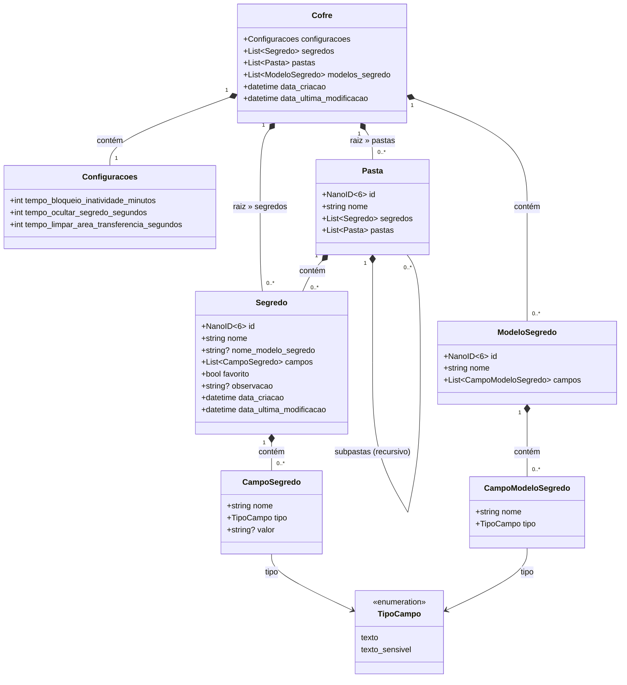

# Modelo de Domínio — Abditum

| Item              | Detalhe                                   |
|-------------------|-------------------------------------------|
| **Projeto**       | Abditum — Cofre de Senhas Portátil        |
| **Versão**        | 1.0                                       |
| **Data**          | 2026-03-25                                |

---

## 1. Visão Geral

O modelo de domínio do Abditum descreve as entidades, seus atributos, relacionamentos e invariantes que regem o cofre de senhas portátil. A arquitetura segue DDD com padrão Manager: entidades são navegáveis somente leitura, e toda mutação ocorre via métodos explícitos do Manager.

---

## 2. Entidades do Domínio

### 2.1. Cofre

Raiz agregada que contém toda a estrutura persistida em um único arquivo `.abditum`.

| Atributo                                    | Tipo                  | Obrigatório | Descrição                                                         |
|---------------------------------------------|-----------------------|-------------|-------------------------------------------------------------------|
| configuracoes                               | Configuracoes         | Sim         | Configurações operacionais do cofre                               |
| segredos                                    | list[Segredo]         | Sim         | Segredos na raiz do cofre (ordenação por posição)                 |
| pastas                                      | list[Pasta]           | Sim         | Pastas na raiz do cofre (ordenação por posição)                   |
| modelos_segredo                             | list[ModeloSegredo]   | Sim         | Modelos de segredo disponíveis no cofre                           |
| data_criacao                                | datetime              | Sim         | Data/hora de criação do cofre                                     |
| data_ultima_modificacao                     | datetime              | Sim         | Data/hora da última modificação persistida                        |

> A raiz do cofre funciona como uma "pasta sem nome", contendo segredos e subpastas em qualquer nível de aninhamento.

### 2.2. Configuracoes

Configurações embutidas no próprio cofre, garantindo portabilidade total.

| Atributo                                    | Tipo    | Padrão | Descrição                                                           |
|---------------------------------------------|---------|--------|---------------------------------------------------------------------|
| tempo_bloqueio_inatividade_minutos          | inteiro | 2      | Minutos de inatividade até bloqueio automático                      |
| tempo_ocultar_segredo_segundos              | inteiro | 15     | Segundos até reocultação automática de campo sensível revelado      |
| tempo_limpar_area_transferencia_segundos    | inteiro | 30     | Segundos até limpeza automática da área de transferência            |

### 2.3. Segredo

Item individual que armazena informações confidenciais do usuário.

| Atributo                 | Tipo               | Obrigatório | Descrição                                                                  |
|--------------------------|---------------------|-------------|---------------------------------------------------------------------------|
| id                       | NanoID (6 chars)    | Sim         | Identidade única alfanumérica                                              |
| nome                     | string              | Sim         | Nome de exibição (não é identificador; duplicatas permitidas)              |
| nome_modelo_segredo      | string              | Não         | Nome do modelo usado na criação (snapshot, sem vínculo por referência)      |
| campos                   | list[CampoSegredo]  | Sim         | Campos do segredo (ordenação por posição)                                  |
| favorito                 | booleano            | Sim         | Indicador de destaque para acesso rápido                                   |
| observacao               | string              | Não         | Texto livre não sensível (implícito em todo segredo, não removível)        |
| data_criacao             | datetime            | Sim         | Data/hora de criação                                                       |
| data_ultima_modificacao  | datetime            | Sim         | Data/hora da última modificação                                            |

### 2.4. CampoSegredo

Elemento individual dentro de um segredo que armazena um dado específico.

| Atributo | Tipo                            | Obrigatório | Descrição                                                        |
|----------|---------------------------------|-------------|------------------------------------------------------------------|
| nome     | string                          | Sim         | Nome de exibição do campo                                        |
| tipo     | enum (texto, texto_sensivel)    | Sim         | Define a natureza do dado (visível ou protegido)                 |
| valor    | string                          | Não         | Conteúdo do campo; string vazia = campo existente não preenchido |

### 2.5. Pasta

Contêiner estrutural para organizar segredos e subpastas em hierarquia recursiva.

| Atributo  | Tipo             | Obrigatório | Descrição                                                   |
|-----------|------------------|-------------|-------------------------------------------------------------|
| id        | NanoID (6 chars) | Sim         | Identidade única alfanumérica                               |
| nome      | string           | Sim         | Nome de exibição (duplicatas permitidas)                    |
| segredos  | list[Segredo]    | Sim         | Segredos contidos nesta pasta (ordenação por posição)       |
| pastas    | list[Pasta]      | Sim         | Subpastas contidas nesta pasta (ordenação por posição)      |

### 2.6. ModeloSegredo

Estrutura reutilizável para criação de novos segredos com campos pré-definidos.

| Atributo | Tipo                        | Obrigatório | Descrição                                       |
|----------|-----------------------------|-------------|--------------------------------------------------|
| id       | NanoID (6 chars)            | Sim         | Identidade única alfanumérica                    |
| nome     | string                      | Sim         | Nome de exibição do modelo                       |
| campos   | list[CampoModeloSegredo]    | Sim         | Campos-template do modelo (ordenação por posição)|

### 2.7. CampoModeloSegredo

Elemento-template dentro de um modelo de segredo, definindo estrutura sem valor.

| Atributo | Tipo                            | Obrigatório | Descrição                          |
|----------|---------------------------------|-------------|-------------------------------------|
| nome     | string                          | Sim         | Nome do campo-template              |
| tipo     | enum (texto, texto_sensivel)    | Sim         | Tipo do dado esperado               |

---

## 3. Enumerações

### 3.1. TipoCampo

| Valor            | Descrição                                                                 |
|------------------|---------------------------------------------------------------------------|
| texto            | Dado não sensível — participa da busca, exibido livremente                |
| texto_sensivel   | Dado confidencial — nunca participa da busca, oculto por padrão           |

---

## 4. Diagrama de Classes (Mermaid)

---

## 5. Pastas Virtuais (Agrupamentos Lógicos)

Pastas virtuais não existem como entidades persistidas; são projeções de interface calculadas em tempo de execução.

| Pasta Virtual | Regra de Materialização                                                         |
|---------------|---------------------------------------------------------------------------------|
| **Favoritos** | Segredos com `favorito == true`, exibidos no topo da raiz (se houver)           |
| **Lixeira**   | Segredos excluídos reversivelmente, exibidos no final da raiz (se houver)       |

---

## 6. Estrutura Inicial do Cofre

Ao criar um novo cofre, a aplicação popula a hierarquia com os seguintes elementos padrão:

### 6.1. Pastas Pré-definidas

| Pasta        |
|--------------|
| Sites        |
| Financeiro   |
| Serviços     |

### 6.2. Modelos de Segredo Pré-definidos

| Modelo              | Campos                                                                                  |
|----------------------|-----------------------------------------------------------------------------------------|
| Login                | URL (texto), Username (texto), Password (texto_sensivel)                                |
| Cartão de Crédito    | Número do Cartão (texto_sensivel), Nome no Cartão (texto), Data de Validade (texto), CVV (texto_sensivel) |
| API Key              | Nome da API (texto), Chave de API (texto_sensivel)                                      |

---

## 7. Decisões de Modelagem

| # | Decisão                         | Racional                                                                                                  |
|---|----------------------------------|------------------------------------------------------------------------------------------------------------|
| 1 | Hierarquia recursiva             | A raiz funciona como pasta sem nome; pastas podem conter segredos e subpastas sem limite de profundidade    |
| 2 | Ordenação por posição            | A ordem dos elementos no JSON reflete diretamente a ordem de exibição na interface                         |
| 3 | Modelo como snapshot             | Segredos criados a partir de modelos não mantêm vínculo; `nome_modelo_segredo` é apenas registro histórico |
| 4 | IDs NanoID 6 chars alfanuméricos | 62⁶ ≈ 56 bilhões de combinações; unicidade prática sem coordenação central                                |
| 5 | Nomes não identificadores        | Nome é atributo editável, não participa da identidade; duplicatas são permitidas                           |
| 6 | Campos uniformes                 | Valor string vazia = campo existente não preenchido; sem distinção de estado preenchido/vazio              |
| 7 | Observação implícita             | Todo segredo possui observação (opcional); não é declarada nos modelos; dado não sensível                  |
| 8 | Busca sequencial em memória      | Sem índices persistidos; varredura sobre estrutura carregada; volume esperado é pequeno                    |
| 9 | Configurações embutidas          | Armazenadas dentro do cofre → portabilidade total sem arquivos externos                                   |

---

## 8. Invariantes do Domínio

| #  | Invariante                                                                                                        |
|----|-------------------------------------------------------------------------------------------------------------------|
| I1 | Só pode existir um cofre ativo por vez                                                                            |
| I2 | Um segredo não pode estar simultaneamente na hierarquia principal e na Lixeira                                     |
| I3 | Um segredo só pode estar na raiz ou em uma pasta, nunca em ambos, nem em duas pastas ao mesmo tempo               |
| I4 | Uma pasta só pode estar na raiz ou dentro de outra pasta, nunca em ambos, nem em duas pastas ao mesmo tempo       |
| I5 | O estado `Cofre Modificado` deve refletir qualquer divergência entre memória e último salvamento persistido       |
| I6 | A Lixeira só materializa segredos excluídos reversivelmente                                                       |
| I7 | Ao salvar, segredos na Lixeira são permanentemente excluídos, sem possibilidade de recuperação                    |
| I8 | Pastas não possuem soft delete; exclusão remove a pasta e promove filhos ao pai                                   |
| I9 | Campos `texto_sensivel` nunca participam de busca, independentemente do estado visual                             |

---

## 9. Rastreabilidade

| Entidade          | Requisitos Funcionais                          | Regras de Negócio            |
|-------------------|------------------------------------------------|------------------------------|
| Cofre             | [RF-01](srs.md#rf-01) a [RF-11](srs.md#rf-11)                                 | [RN-01](regras-negocio.md#rn-01) a [RN-05](regras-negocio.md#rn-05)                |
| Configuracoes     | [RF-11](srs.md#rf-11)                                          | [RN-04](regras-negocio.md#rn-04)                        |
| Segredo           | [RF-12](srs.md#rf-12) a [RF-26](srs.md#rf-26)                                  | [RN-06](regras-negocio.md#rn-06), [RN-08](regras-negocio.md#rn-08) a [RN-12](regras-negocio.md#rn-12), [RN-14](regras-negocio.md#rn-14)  |
| CampoSegredo      | [RF-17](srs.md#rf-17), [RF-18](srs.md#rf-18), [RF-19](srs.md#rf-19), [RF-20](srs.md#rf-20), [RF-21](srs.md#rf-21)             | [RN-09](regras-negocio.md#rn-09), [RN-10](regras-negocio.md#rn-10)                 |
| Pasta             | [RF-27](srs.md#rf-27) a [RF-31](srs.md#rf-31)                                  | [RN-07](regras-negocio.md#rn-07), [RN-16](regras-negocio.md#rn-16)                 |
| ModeloSegredo      | [RF-32](srs.md#rf-32) a [RF-35](srs.md#rf-35)                                  | [RN-17](regras-negocio.md#rn-17), [RN-18](regras-negocio.md#rn-18)                 |
| CampoModeloSegredo| [RF-32](srs.md#rf-32), [RF-33](srs.md#rf-33)                                   | [RN-17](regras-negocio.md#rn-17)                        |
