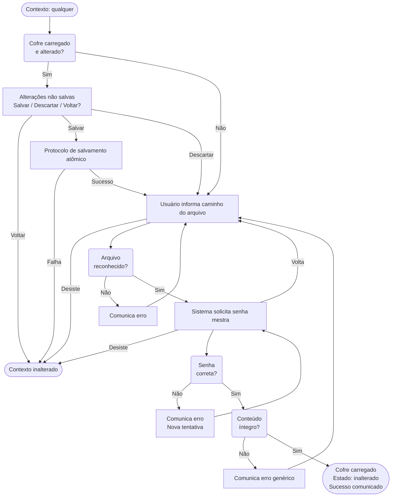
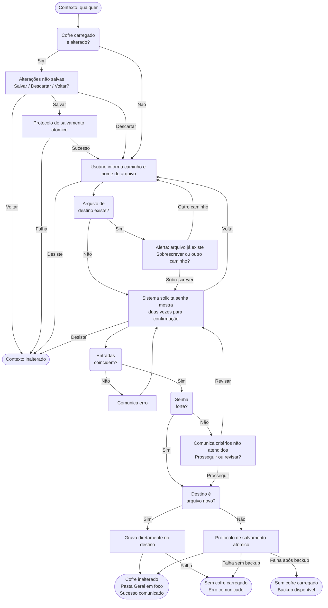
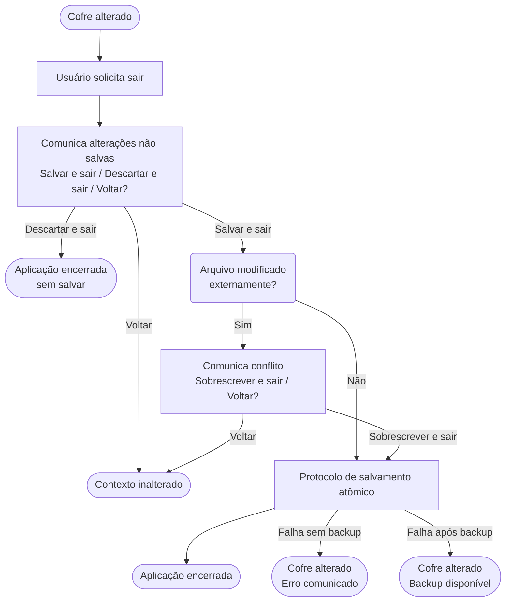
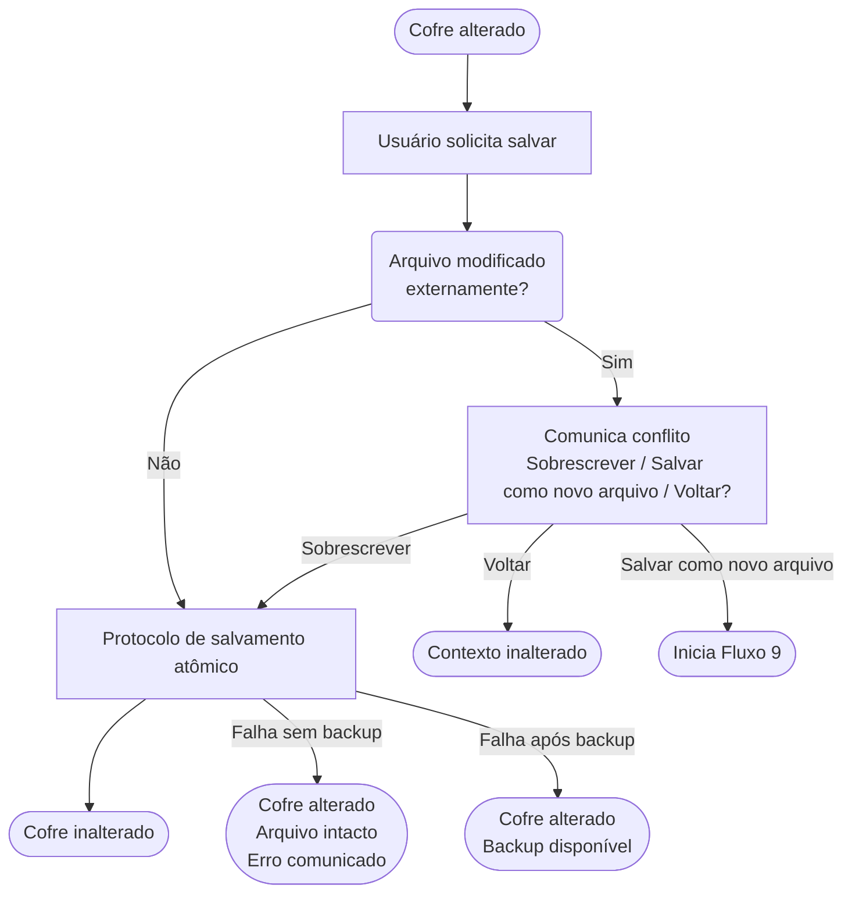
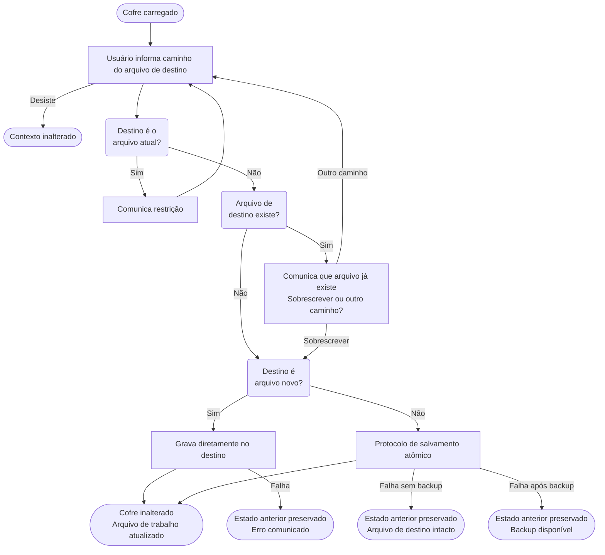
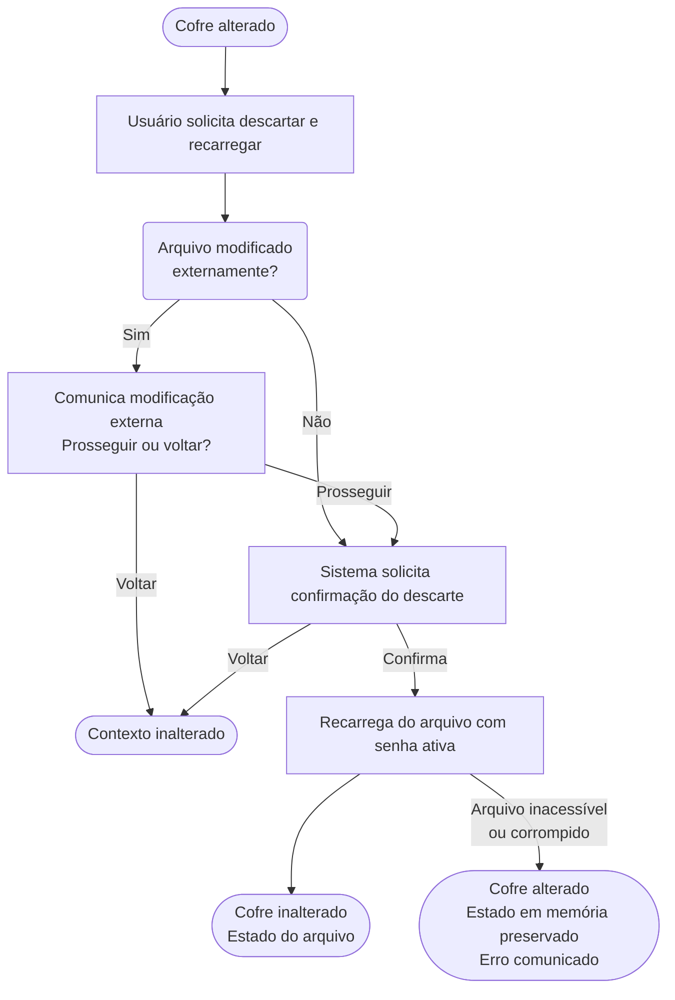
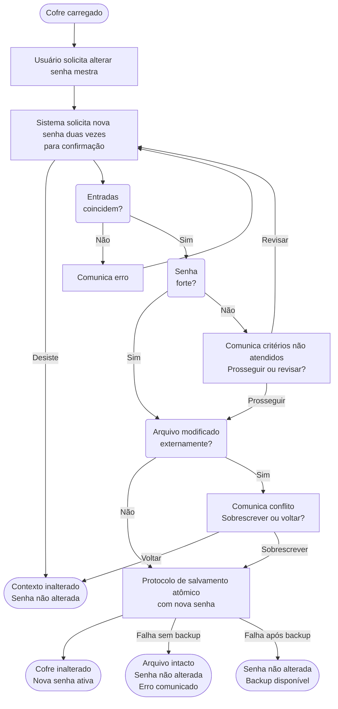
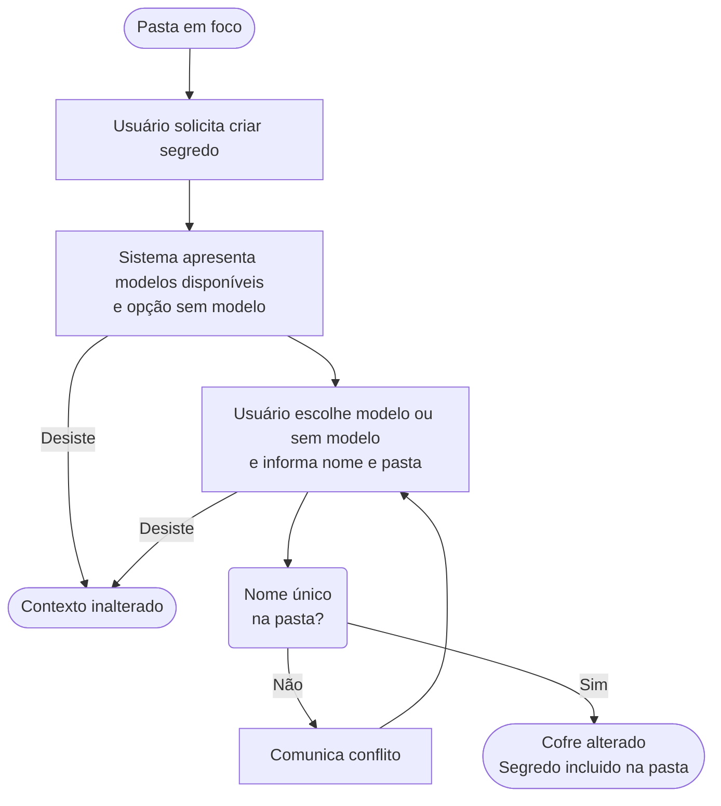
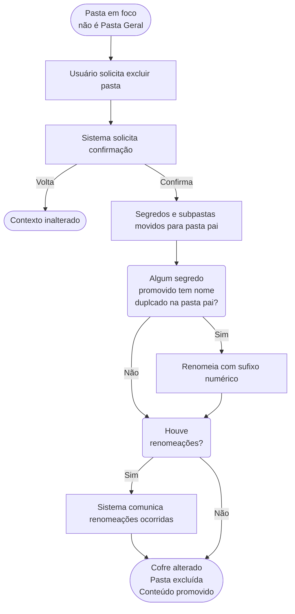

# Fluxos de Tarefas — Abditum

Este documento descreve como o usuário realiza as principais tarefas na aplicação, do ponto de vista da experiência — o que o usuário faz e o que acontece como resultado.

---

## Princípios deste documento

### Independência de UI

Os fluxos descrevem interações de forma **independente de qualquer solução de UI** — a decisão de como realizá-las na interface é tomada durante a implementação.

O vocabulário é cuidadosamente neutro:

| Em vez de... | Usamos... |
|---|---|
| "exibe um campo para" | "o sistema solicita" |
| "digita no campo" | "o usuário informa" |
| "mostra uma mensagem" | "o sistema comunica" |
| "seleciona numa lista" | "o usuário escolhe entre" |

### Fluxos como especificação

Os fluxos são **especificação do comportamento esperado**, escritos antes da implementação para que cada decisão de UX seja explícita.

---

## Relação com Outros Documentos

Este documento descreve **fluxos**, que diferem de outros tipos de especificação usados no projeto:

### Casos de Uso vs. Fluxos

**Casos de uso** descrevem *o que* o sistema faz do ponto de vista de um ator — um inventário de capacidades. Exemplos: "Abrir cofre", "Criar segredo". Não descrevem sequência, decisões ou erros.

**Fluxos** descrevem *como* o usuário realiza uma tarefa do início ao fim, com decisões, ramificações e resultados. Cobrem caminho feliz e caminhos alternativos numa narrativa unificada.

### Cenários de BDD vs. Fluxos

**Cenários de BDD** (Given/When/Then) descrevem exemplos concretos e verificáveis de um comportamento. São orientados a teste — cada cenário é uma afirmação que passa ou falha. Exemplo: "Dado que o cofre está aberto e o segredo está em foco, quando o usuário marca para exclusão, então o segredo mostra indicador de excluído."

**Fluxos** são mais amplos: um único fluxo desdobra-se em múltiplos cenários de BDD, cada um cobrindo uma ramificação ou condição específica. O fluxo é a narrativa; os cenários são testes dessa narrativa.

### Relação de Granularidade

Os três documentos descrevem o mesmo sistema com propósitos diferentes:

- **Casos de uso → Fluxos**: o fluxo expande o caso de uso, detalhando passo a passo, decisões e ramificações.
- **Fluxos → Cenários BDD**: cada caminho do fluxo é um cenário candidato. Um fluxo com três saídas possíveis gera ao menos 3 cenários BDD.

Cada um é uma lente diferente — *inventário de capacidades*, *experiência completa*, *verificação automática* — com granularidade crescente nessa ordem.

---

## Conceitos de contexto

O **contexto** é o conjunto de condições necessárias para um fluxo poder começar. Descreve *o estado lógico do sistema*, não o caminho percorrido pelo usuário — um mesmo **contexto** pode ser alcançado por múltiplos caminhos, e os fluxos se comportam de acordo com o **contexto**, independentemente de como se chegou a ele.

O contexto é composto por quatro dimensões de navegação — **foco**, **contexto implícito ao foco**, **entorno local** e **entorno global** —, ordenadas do mais específico ao mais abrangente. Cada dimensão é populada por elementos: objetos, entidades ou variáveis de estado. Não é só a presença do elemento que caracteriza o contexto, mas também o estado dos seus atributos.

### Foco

O **foco** é o *assunto do momento* no contexto — o elemento com o qual o usuário está trabalhando. É um conceito lógico, não visual, e independe de eventual destaque provido via UI. O foco também independe de como o usuário chegou até ele: dois caminhos diferentes podem levar ao mesmo foco, e o contexto apresentado para os fluxos será idêntico.

**Nota:** pode não haver foco. O contexto é então descrito pelas demais dimensões.

#### Contexto implícito ao foco

Quando um elemento está em foco, outros elementos fortemente acoplados a ele entram implicitamente no contexto — não por decisão do designer, mas por consequência lógica da estrutura do sistema. O contexto implícito não necessariamente está visível para o usuário.

No caso mais concreto — elementos em **hierarquia de árvore** — os ancestrais do elemento em foco estão sempre implicitamente em contexto, porque um elemento não pode existir sem seu container. O pai é parte indissolúvel do contexto do filho. O contexto implícito existe logicamente e afeta quais ações são aplicáveis, mesmo que a UI não o destaque visualmente.

### Entorno local

O **entorno local** é o conjunto de elementos que entram no contexto a partir de como a UI apresenta o estado lógico da aplicação.

Junto com essa apresentação, outros elementos podem compor o contexto. Dois exemplos concretos:

- **Modo de operação:** se o designer usa o mesmo formulário tanto para visualizar quanto para editar dados, o modo — visualização ou edição — torna-se parte do entorno local e determina quais ações estão disponíveis.
- **Dados de integração:** se a UI apresenta, ao lado do dado da aplicação, dados obtidos via integração externa para comparação, esses elementos também compõem o entorno local — e os fluxos que permitem escolher qual dado usar dependem de sua presença no contexto.

Os fluxos **não declaram o entorno local** nas pré-condições — ele é uma consequência do foco e das decisões de UI, resolvida durante o design.

#### Modo

O **modo** é uma variável de estado do entorno local especialmente relevante para os fluxos: determina quais ações estão disponíveis e, por isso, é frequentemente declarado como pré-condição — "modo visualização", "modo edição".

### Entorno global

O **entorno global** é o conjunto de elementos presentes no contexto durante toda a sessão, independentemente do foco.

Exemplo concreto: o usuário autenticado é entorno global em sistemas com conta — habilita fluxos como editar perfil, ver permissões e alterar senha a qualquer momento, independentemente do que estiver em foco.

### Contexto necessário no fluxo

Cada fluxo declara qual contexto é necessário para ser iniciado — combinando condições sobre foco, entorno global, modo e estado das entidades, usadas apenas quando relevantes ao fluxo. Se o contexto necessário não for integralmente atendido, o fluxo não pode ser iniciado.

### Contexto resultante

O **contexto resultante** descreve as condições que serão verdadeiras após o fluxo terminar. Um fluxo pode ter múltiplas saídas — sucesso, cancelamento, erro —, cada uma com um contexto resultante diferente.

### Fluxo elegível

Um fluxo é **elegível** quando seu contexto necessário é integralmente atendido — o usuário pode iniciá-lo agora. Os controles que iniciam fluxos aparecem habilitados apenas para fluxos elegíveis.

## Contexto no Abditum

Esta seção especifica os estados, níveis de foco e modos concretos do Abditum.

### Estado do cofre

Sincronização entre memória e disco — integra o entorno global da sessão. Só existe quando há um cofre carregado.

| Estado | Descrição |
|--------|-----------|
| `inalterado` | Conteúdo em memória coincide com o arquivo em disco |
| `alterado` | Há mudanças não salvas na memória desde a última gravação ou criação |

### Estado do segredo

Conforme definido em `modelo-dominio.md`. Costuma integrar o foco ou o entorno local.

| Estado | Descrição |
|--------|-------|
| `original` | Carregado do arquivo sem alterações na sessão |
| `incluido` | Criado durante a sessão, ainda não gravado |
| `modificado` | Existia no arquivo e foi alterado na sessão |
| `excluido` | Marcado para remoção ao salvar |

### Foco no Abditum

Quando há um cofre carregado, os focos recorrentes formam uma hierarquia onde cada nível implica os anteriores.

| Nível | Descrição |
|-------|-----------|
| **pasta em foco** | Uma pasta é o assunto. Sempre existe — no mínimo a Pasta Geral está em foco |
| **segredo em foco** | Um ou mais segredos são o assunto. Pode não haver nenhum |
| **segredo aberto** | O conteúdo de um segredo está sendo apresentado. Implica segredo em foco |
| **campo em foco** | Um campo específico dentro de um segredo aberto é o assunto. Implica segredo aberto |

### Modos no Abditum

#### Modo na apresentação do segredo

| Modo | Descrição |
|------|-----------|
| **Visualização** | Leitura do conteúdo; sem alteração de dados |
| **Edição de valores** | Revisão e modificação dos valores dos campos |
| **Alteração de estrutura** | Adição, remoção ou reordenação de campos |

#### Modo na apresentação do cofre

| Modo | Descrição |
|------|-----------|
| **Visualização/navegação** | Navegar entre pastas e segredos |
| **Busca** | Filtragem de segredos por critério |

---

## Estrutura de cada fluxo

Cada fluxo é composto por:

- **Contexto necessário** — o que precisa ser verdade para o fluxo poder iniciar
- **Passos** — a sequência de interações, com ramificações explícitas
- **Contexto resultante** — o que muda ao final de cada caminho de saída do fluxo
- **Diagrama** — representação visual opcional, incluída quando o fluxo tem ramificações que se beneficiam de uma visão panorâmica

---

## Fluxo 1 — Abrir Cofre Existente

**Contexto necessário:** nenhum. O fluxo é elegível independentemente de haver ou não um cofre carregado.

**Nota sobre a UX atual:** a interface não oferece o gesto de abrir cofre enquanto há um cofre carregado. Essa é uma restrição de UX, não do fluxo — o fluxo em si não impõe essa limitação.

**Entrada antecipada via argumento de linha de comando:** se a aplicação for iniciada com um caminho de arquivo como argumento, o passo 1 é ignorado (a aplicação está sendo iniciada, não há cofre carregado). O sistema verifica se o arquivo informado existe:
- **Se o arquivo existe** → é reconhecido como cofre válido. O passo 2 é ignorado (caminho já definido) e o fluxo avança direto para a solicitação de senha (passo 3).
- **Se o arquivo não existe** → o Fluxo 1 não se aplica. A aplicação inicia o Fluxo 2 (Criar Novo Cofre) a partir do passo 3, com o caminho já preenchido.

**Passos:**

1. O sistema verifica se há um cofre carregado com modificações não salvas.
   - Se houver → o sistema comunica as alterações não salvas e solicita uma decisão: salvar e prosseguir, descartar e prosseguir, ou voltar.
     - Se o usuário escolhe salvar e prosseguir → o cofre é gravado no arquivo atual usando o protocolo de salvamento atômico. Se o salvamento falhar, o fluxo é interrompido e o cofre permanece carregado e `alterado`. Se bem-sucedido, continua para o passo 2.
     - Se o usuário escolhe descartar e prosseguir → continua para o passo 2.
     - Se o usuário escolhe voltar → o fluxo é interrompido e nada muda.
   - Se não houver modificações ou não houver cofre carregado → continua para o passo 2.
2. O usuário informa o caminho do arquivo do cofre. O usuário pode desistir e abandonar o fluxo a qualquer momento neste passo.
   - Se o arquivo não for reconhecido como cofre válido → o sistema comunica o erro. O usuário pode corrigir o caminho e tentar novamente. Volta ao passo 2.
3. O sistema solicita a senha mestra. O usuário a informa. O usuário pode desistir e voltar ao passo 2.
   - Se a senha estiver incorreta → o sistema comunica o erro (categoria: autenticação). O usuário pode tentar novamente. Volta ao passo 3.
4. O sistema verifica a integridade do conteúdo do arquivo.
   - Se o conteúdo estiver corrompido → o sistema comunica o erro genérico (categoria: integridade). Volta ao passo 2.
5. O cofre atual, se houver, é fechado. O novo cofre é carregado. O sistema comunica que o cofre foi aberto com sucesso.

**Contexto resultante:**
- Fluxo abandonado → contexto inalterado.
- Falha ao salvar cofre atual → cofre permanece carregado e `alterado`; fluxo interrompido.
- Sucesso → cofre `inalterado`, pasta Geral em foco.

---

## Fluxo 2 — Criar Novo Cofre

**Contexto necessário:** nenhum. O fluxo é elegível independentemente de haver ou não um cofre carregado.

**Nota sobre a UX atual:** a interface não oferece o gesto de criar cofre enquanto há um cofre carregado. Essa é uma restrição de UX, não do fluxo — o fluxo em si não impõe essa limitação.

**Entrada antecipada via argumento de linha de comando:** se a aplicação for iniciada com um caminho de arquivo como argumento e o arquivo não existir, o passo 1 é ignorado (a aplicação está sendo iniciada, não há cofre carregado) e o passo 2 é ignorado (caminho já definido). O fluxo inicia no passo 3, com o caminho já preenchido.

**Passos:**

1. O sistema verifica se há um cofre carregado com modificações não salvas.
   - Se houver → o sistema comunica as alterações não salvas e solicita uma decisão: salvar e prosseguir, descartar e prosseguir, ou voltar.
     - Se o usuário escolhe salvar e prosseguir → o cofre é gravado no arquivo atual usando o protocolo de salvamento atômico. Se o salvamento falhar, o fluxo é interrompido e o cofre permanece carregado e `alterado`. Se bem-sucedido, continua para o passo 2.
     - Se o usuário escolhe descartar e prosseguir → continua para o passo 2.
     - Se o usuário escolhe voltar → o fluxo é interrompido e nada muda.
   - Se não houver modificações ou não houver cofre carregado → continua para o passo 2.
2. O usuário informa onde salvar o arquivo do cofre (caminho e nome). A extensão `.abditum` é adicionada automaticamente se omitida. O usuário pode desistir e abandonar o fluxo a qualquer momento neste passo.
   - Se o arquivo de destino já existir → o sistema alerta que o arquivo já existe e solicita uma decisão: sobrescrever ou informar outro caminho.
     - Se o usuário escolhe informar outro caminho → volta ao passo 2.
     - Se o usuário escolhe sobrescrever → continua para o passo 3.
   - Se o arquivo de destino não existir → continua para o passo 3.
3. O sistema solicita a senha mestra. O usuário a informa duas vezes para confirmação. O usuário pode desistir e voltar ao passo 2.
   - Se as duas entradas não coincidem → o sistema comunica o erro. Volta ao passo 3.
4. O sistema avalia a força da senha.
   - Se a senha for considerada fraca → o sistema comunica os critérios não atendidos e solicita uma decisão: prosseguir mesmo assim ou revisar a senha.
     - Se o usuário escolhe revisar → volta ao passo 3.
     - Se o usuário escolhe prosseguir → continua para o passo 5.
5. O novo cofre é criado com a estrutura inicial e gravado em disco.
   - Se o destino for um arquivo novo: a gravação ocorre diretamente no destino final.
     - Se falhar → o sistema comunica o erro. O fluxo é encerrado sem cofre carregado.
   - Se o destino for um arquivo existente (sobrescrita): é utilizado o protocolo de salvamento atômico.
     - Se falhar sem ter gerado backup → o sistema comunica o erro. O arquivo original permanece intacto. O fluxo é encerrado sem cofre carregado.
     - Se falhar após ter gerado backup → o sistema comunica o erro e informa que existe um backup disponível para intervenção manual. O fluxo é encerrado sem cofre carregado.
6. O cofre atual, se houver, é fechado. O novo cofre é carregado. O sistema comunica que o novo cofre foi criado com sucesso.

**Contexto resultante:**
- Fluxo abandonado → contexto inalterado.
- Falha ao salvar cofre atual → cofre permanece carregado e `alterado`; fluxo interrompido.
- Sucesso → cofre `inalterado`, pasta Geral em foco.
- Falha na gravação do novo cofre → sem cofre carregado.

---

## Fluxo 3 — Sair sem cofre aberto

**Contexto necessário:** nenhum cofre carregado.

**Passos:**

1. O usuário solicita sair.
2. O sistema solicita confirmação.
   - Se o usuário confirma → a aplicação encerra.
   - Se o usuário volta → o fluxo é interrompido e nada muda.

**Contexto resultante:**
- Confirmado → aplicação encerrada.
- Voltou → contexto inalterado.

---

## Fluxo 4 — Sair com cofre aberto sem modificações

**Contexto necessário:** cofre carregado no entorno global; cofre `inalterado`.

**Passos:**

1. O usuário solicita sair.
2. O sistema solicita confirmação.
   - Se o usuário confirma → a aplicação encerra.
   - Se o usuário volta → o fluxo é interrompido e nada muda.

**Contexto resultante:**
- Confirmado → aplicação encerrada.
- Voltou → contexto inalterado.

---

## Fluxo 5 — Sair com cofre aberto com modificações

**Contexto necessário:** cofre carregado no entorno global; cofre `alterado`.

**Passos:**

1. O usuário solicita sair.
2. O sistema comunica que há alterações não salvas e solicita uma decisão: salvar e sair, descartar e sair, ou voltar.
   - Se o usuário escolhe descartar e sair → a aplicação encerra sem salvar.
   - Se o usuário escolhe voltar → o fluxo é interrompido e nada muda.
   - Se o usuário escolhe salvar e sair → continua para o passo 3.
3. O sistema verifica se o arquivo foi modificado externamente desde a última leitura ou salvamento.
   - Se foi modificado externamente → o sistema comunica o conflito e solicita uma decisão: sobrescrever e sair, ou voltar.
     - Se o usuário escolhe voltar → o fluxo é interrompido e nada muda.
     - Se o usuário escolhe sobrescrever e sair → continua para o passo 4.
4. O cofre é gravado no arquivo atual usando o protocolo de salvamento atômico. Segredos marcados para exclusão não são gravados.
   - Se o salvamento falhar sem ter gerado backup → o sistema comunica o erro. O cofre permanece carregado e `alterado`.
   - Se o salvamento falhar após ter gerado backup → o sistema comunica o erro e informa que existe um backup disponível para intervenção manual. O cofre permanece carregado e `alterado`.
5. A aplicação encerra.

**Contexto resultante:**
- Salvar e sair (sucesso) → aplicação encerrada.
- Salvar e sair (falha) → cofre carregado e `alterado`; arquivo original intacto.
- Descartar e sair → aplicação encerrada.
- Voltou → contexto inalterado.

---

## Fluxo 6 — Bloquear cofre

**Contexto necessário:** cofre carregado no entorno global.

**Nota sobre o acionamento:** este fluxo pode ser iniciado pelo usuário (bloqueio manual) ou pelo sistema quando o temporizador de inatividade expira (bloqueio automático). O comportamento é idêntico nos dois casos.

**Nota sobre alterações não salvas:** se houver alterações não salvas, elas são descartadas silenciosamente — sem confirmação. Essa é uma decisão de projeto: o bloqueio por inatividade ocorre em sessão desassistida, e o bloqueio manual pode ter caráter emergencial (proteção contra visualização não autorizada), tornando a confirmação inadequada em ambos os casos.

**Passos:**

1. O cofre é bloqueado: buffers sensíveis são limpos, a área de transferência é limpa e a tela é apagada.
2. O sistema inicia o Fluxo 1 — Abrir Cofre Existente — a partir do passo 3: o caminho do cofre recém-bloqueado está preenchido e o arquivo já reconhecido, de modo que o sistema solicita diretamente a senha mestra. Se o arquivo não for mais acessível ou estiver corrompido, o Fluxo 1 retorna ao passo 2 para o usuário informar outro caminho.

**Contexto resultante:**
- Cofre bloqueado → Fluxo 1 iniciado no passo 3, com o caminho do cofre preenchido.

---

## Fluxo 7 — Aviso de bloqueio iminente por inatividade

**Contexto necessário:** cofre carregado no entorno global; temporizador de inatividade atingiu o limiar de aviso (75% do tempo configurado).

**Nota:** o aviso prévio de bloqueio é uma decisão de UX — os requisitos não o mencionam explicitamente, mas ele melhora a experiência do usuário ao evitar surpresas com o bloqueio automático.

**Passos:**

1. O sistema comunica que o cofre será bloqueado em breve por inatividade.
2. O sistema aguarda a expiração do temporizador restante ou atividade do usuário.
   - Se o usuário interagir com a aplicação → o temporizador de inatividade é reiniciado e o aviso é dispensado. O fluxo é encerrado.
   - Se o temporizador expirar → o aviso é dispensado e o sistema inicia o Fluxo 6 (Bloquear cofre).

**Contexto resultante:**
- Usuário interagiu → contexto inalterado; temporizador reiniciado.
- Temporizador expirou → Fluxo 6 iniciado.

---

## Fluxo 8 — Salvar cofre no arquivo atual

**Contexto necessário:** cofre carregado no entorno global; cofre `alterado`.

**Passos:**

1. O usuário solicita salvar.
2. O sistema verifica se o arquivo foi modificado externamente desde a última leitura ou salvamento.
   - Se foi modificado externamente → o sistema comunica o conflito e solicita uma decisão: sobrescrever, salvar como novo arquivo, ou voltar.
     - Se o usuário escolhe sobrescrever → continua para o passo 3.
     - Se o usuário escolhe salvar como novo arquivo → o fluxo é interrompido e o Fluxo 9 (Salvar cofre em outro arquivo) é iniciado.
     - Se o usuário escolhe voltar → o fluxo é interrompido e nada muda.
3. O cofre é gravado no arquivo atual usando o protocolo de salvamento atômico. Segredos marcados para exclusão não são gravados; após o salvamento bem-sucedido, são removidos da memória.
   - Se o salvamento falhar sem ter gerado backup → o sistema comunica o erro. O arquivo original permanece intacto e o estado em memória é preservado.
   - Se o salvamento falhar após ter gerado backup → o sistema comunica o erro e informa que existe um backup disponível para intervenção manual. O estado em memória é preservado.

**Contexto resultante:**
- Sucesso → cofre `inalterado`.
- Falha → cofre `alterado`; arquivo original intacto.
- Voltou → contexto inalterado.

---

## Fluxo 9 — Salvar cofre em outro arquivo

**Contexto necessário:** cofre carregado no entorno global.

**Nota:** este fluxo é elegível independentemente do estado do cofre — pode ser iniciado com cofre `inalterado` ou `alterado`.

**Passos:**

1. O usuário informa o caminho do novo arquivo de destino. O usuário pode desistir e abandonar o fluxo a qualquer momento neste passo.
   - Se o caminho informado for o mesmo do arquivo atual do cofre → o sistema comunica que o destino não pode ser o arquivo atual e solicita outro caminho. Volta ao passo 1.
   - Se o arquivo de destino já existir → o sistema comunica que o arquivo já existe e solicita uma decisão: sobrescrever ou informar outro caminho.
     - Se o usuário escolhe informar outro caminho → volta ao passo 1.
     - Se o usuário escolhe sobrescrever → continua para o passo 2.
2. O cofre é gravado no arquivo de destino. Segredos marcados para exclusão não são gravados; após o salvamento bem-sucedido, são removidos da memória.
   - Se o destino for um arquivo novo (não existia): a gravação ocorre diretamente no destino final.
     - Se falhar → o sistema comunica o erro. O estado em memória é preservado e o arquivo de trabalho permanece o original.
   - Se o destino for um arquivo existente (sobrescrita): é utilizado o protocolo de salvamento atômico.
     - Se falhar sem ter gerado backup → o sistema comunica o erro. O arquivo de destino permanece intacto e o arquivo de trabalho permanece o original.
     - Se falhar após ter gerado backup → o sistema comunica o erro e informa que existe um backup disponível para intervenção manual. O arquivo de trabalho permanece o original.
3. O arquivo de trabalho passa a ser o novo arquivo. Próximas modificações e salvamentos ocorrem sobre ele.

**Contexto resultante:**
- Fluxo abandonado → contexto inalterado.
- Sucesso → cofre `inalterado`; arquivo de trabalho atualizado para o novo caminho.
- Falha → cofre no estado anterior; arquivo de trabalho inalterado.

---

## Fluxo 10 — Descartar alterações e recarregar cofre

**Contexto necessário:** cofre carregado no entorno global; cofre `alterado`.

**Passos:**

1. O usuário solicita descartar alterações e recarregar.
2. O sistema verifica se o arquivo foi modificado externamente desde a última leitura ou salvamento.
   - Se foi modificado externamente → o sistema comunica o fato e solicita confirmação para prosseguir com o recarregamento.
     - Se o usuário volta → o fluxo é interrompido e nada muda.
3. O sistema solicita confirmação do descarte.
   - Se o usuário volta → o fluxo é interrompido e nada muda.
4. O cofre é recarregado do arquivo usando a senha ativa na sessão, descartando todas as alterações em memória desde o último salvamento ou desde a abertura.
   - Se o arquivo estiver inacessível ou corrompido → o sistema comunica o erro. O cofre permanece no estado em memória anterior ao descarte (ainda `alterado`).

**Contexto resultante:**
- Sucesso → cofre `inalterado`, no estado persistido no arquivo.
- Falha no recarregamento → cofre `alterado`, estado em memória preservado.
- Voltou → contexto inalterado.

---

## Fluxo 11 — Alterar senha mestra

**Contexto necessário:** cofre carregado no entorno global.

**Passos:**

1. O usuário solicita alterar a senha mestra.
2. O sistema solicita a nova senha mestra. O usuário a informa duas vezes para confirmação. O usuário pode desistir e abandonar o fluxo a qualquer momento neste passo.
   - Se as duas entradas não coincidem → o sistema comunica o erro.  Volta ao passo 2.
3. O sistema avalia a força da nova senha.
   - Se a senha for considerada fraca → o sistema comunica os critérios não atendidos e solicita uma decisão: prosseguir mesmo assim ou revisar.
     - Se o usuário escolhe revisar → volta ao passo 2.
     - Se o usuário escolhe prosseguir → continua para o passo 4.
4. O sistema verifica se o arquivo foi modificado externamente desde a última leitura ou salvamento.
   - Se foi modificado externamente → o sistema comunica o conflito e solicita uma decisão: sobrescrever ou voltar.
     - Se o usuário escolhe voltar → o fluxo é interrompido e nada muda; a senha mestra não é alterada.
     - Se o usuário escolhe sobrescrever → continua para o passo 5.
5. O cofre é salvo imediatamente com a nova senha, incluindo todas as alterações pendentes da sessão, usando o protocolo de salvamento atômico. A operação é irrevogável — não é possível desfazê-la após a conclusão.
   - Se o salvamento falhar sem ter gerado backup → o sistema comunica o erro. O arquivo original permanece intacto; a senha mestra não é alterada na sessão.
   - Se o salvamento falhar após ter gerado backup → o sistema comunica o erro e informa que existe um backup disponível para intervenção manual. A senha mestra não é alterada na sessão.

**Contexto resultante:**
- Fluxo abandonado → contexto inalterado; senha mestra não alterada.
- Sucesso → cofre `inalterado`; nova senha mestra ativa na sessão.

**Nota:** após a alteração, o cofre foi regravado com a nova senha e todas as alterações pendentes foram persistidas — o Fluxo 10 (Descartar alterações) deixa de ser elegível.

---

## Fluxo 12 — Exportar cofre

**Contexto necessário:** cofre carregado no entorno global.

**Passos:**

1. O usuário solicita exportar o cofre.
2. O sistema comunica os riscos de segurança da exportação (arquivo não criptografado) e solicita confirmação.
   - Se o usuário volta → o fluxo é interrompido e nada muda.
3. O usuário informa o caminho do arquivo de exportação. O usuário pode desistir e abandonar o fluxo a qualquer momento neste passo.
   - Se o arquivo de destino já existir → o sistema comunica que o arquivo já existe e solicita uma decisão: sobrescrever ou informar outro caminho.
     - Se o usuário escolhe informar outro caminho → volta ao passo 3.
     - Se o usuário escolhe sobrescrever → continua para o passo 4.
4. O cofre é exportado para o arquivo informado. O arquivo contém toda a estrutura do cofre — pastas, segredos ativos e modelos — sem criptografia. Segredos marcados para exclusão não são incluídos. Configurações de timers não são exportadas.
   - Se a exportação falhar → o sistema comunica o erro.

**Contexto resultante:**
- Fluxo abandonado → contexto inalterado.
- Sucesso → arquivo de intercâmbio criado; cofre e sessão inalterados.
- Falha → contexto inalterado.

---

## Fluxo 13 — Importar cofre

**Contexto necessário:** cofre carregado no entorno global.

**Passos:**

1. O usuário solicita importar um cofre.
2. O usuário informa o caminho do arquivo de intercâmbio. O usuário pode desistir e abandonar o fluxo a qualquer momento neste passo.
   - Se o arquivo for inválido em estrutura ou não contiver a Pasta Geral → o sistema comunica o erro. Volta ao passo 2.
3. O sistema comunica a política de mesclagem (pastas mescladas; segredos e modelos com nome conflitante substituídos) e solicita confirmação.
   - Se o usuário volta → o fluxo é interrompido e nada muda.
4. O conteúdo é importado e mesclado ao cofre: pastas mescladas, segredos com nomes únicos adicionados, segredos com nomes conflitantes substituídos, modelos com nomes conflitantes substituídos.
   - Se a mesclagem falhar → o sistema comunica o erro. O cofre permanece no estado anterior à importação.

**Contexto resultante:**
- Fluxo abandonado → contexto inalterado.
- Sucesso → cofre `alterado`, data de update do cofre atualizada, pasta Geral em foco.
- Falha na mesclagem → contexto inalterado.

---

## Fluxo 14 — Configurar o cofre

**Contexto necessário:** cofre carregado no entorno global.

**Passos:**

1. O usuário solicita editar as configurações do cofre.
2. O sistema apresenta as configurações atuais e permite alterá-las: tempo de bloqueio automático por inatividade, tempo de ocultação automática de campo sensível e tempo de limpeza automática da área de transferência. O usuário pode desistir e abandonar o fluxo a qualquer momento neste passo.
3. O usuário confirma as alterações.
4. As novas configurações passam a valer para o comportamento da sessão corrente.

**Contexto resultante:**
- Fluxo abandonado → configurações inalteradas.
- Sucesso → cofre `alterado`; novas configurações ativas na sessão.

---

## Consulta dos Segredos

## Fluxo 15 — Buscar segredos

**Contexto necessário:** cofre carregado no entorno global; modo busca ativo.

**Nota sobre o modo busca:** o modo busca é uma variante do modo de visualização/navegação do cofre. A ativação e o encerramento do modo busca são gestos de navegação, não fluxos — não há contexto necessário adicional para ativá-lo. Este fluxo descreve o que acontece dentro do modo busca.

**Passos:**

1. O usuário informa o termo de busca.
2. O sistema filtra os segredos cujo nome, nome de campo, valor de campo comum ou observação contenham o termo, ignorando acentuação e capitalização. Segredos marcados para exclusão não aparecem nos resultados. Valores de campos sensíveis não participam da busca; nomes de campos sensíveis participam normalmente.
3. O sistema exibe os resultados. O usuário pode refinar o termo a qualquer momento, voltando ao passo 2.

**Contexto resultante:**
- Busca ativa → lista de segredos filtrada pelos resultados; modo busca permanece ativo.

---

## Fluxo 16 — Exibir valor de campo sensível temporariamente

**Contexto necessário:** cofre carregado no entorno global; campo sensível em foco.

**Passos:**

1. O usuário solicita revelar o valor do campo sensível.
2. O sistema exibe o valor do campo em texto claro.
3. Após o tempo configurado de ocultação automática, o sistema oculta o valor novamente.
   - O usuário pode ocultar manualmente antes do tempo expirar.

**Contexto resultante:**
- Sucesso → valor exibido temporariamente; campo retorna ao estado oculto após expiração ou ação manual.

---

## Fluxo 17 — Copiar valor de campo para área de transferência

**Contexto necessário:** cofre carregado no entorno global; campo em foco (comum ou sensível).

**Passos:**

1. O usuário solicita copiar o valor do campo.
2. O sistema copia o valor para a área de transferência.
3. Após o tempo configurado de limpeza automática, o sistema remove o valor da área de transferência — se o suporte do sistema operacional permitir. O valor também é removido ao bloquear ou encerrar a aplicação.

**Contexto resultante:**
- Sucesso → valor copiado para a área de transferência; limpeza automática agendada.

**Nota:** a limpeza da área de transferência depende do suporte do sistema operacional. Se não for possível limpar, o sistema não comunica o fato — a operação de cópia é sempre realizada.

---

## Gerenciamento de Segredos

## Fluxo 18 — Criar segredo

**Contexto necessário:** cofre carregado no entorno global; pasta em foco.

**Passos:**

1. O usuário solicita criar um novo segredo.
2. O sistema apresenta os modelos disponíveis e a opção de criar segredo sem modelo (apenas com a Observação). O usuário escolhe entre eles. O usuário pode desistir e abandonar o fluxo a qualquer momento neste passo.
3. O usuário informa o nome do segredo e a pasta à qual pertencerá. O usuário pode desistir e abandonar o fluxo a qualquer momento neste passo.
   - Se já existir um segredo com o mesmo nome na pasta escolhida → o sistema comunica o conflito. O usuário pode corrigir o nome ou escolher outra pasta. Volta ao passo 3.
4. O segredo é criado na pasta escolhida, com os campos do modelo selecionado (ou somente com a Observação, se sem modelo). O segredo fica em estado `incluido`.

**Contexto resultante:**
- Fluxo abandonado → contexto inalterado.
- Sucesso → cofre `alterado`; novo segredo em estado `incluido` na pasta escolhida.

---

## Fluxo 19 — Duplicar segredo

**Contexto necessário:** cofre carregado no entorno global; segredo em foco.

**Passos:**

1. O usuário solicita duplicar o segredo em foco.
2. O sistema cria um novo segredo com o mesmo conteúdo do original — incluindo campos, valores e histórico de modelo. O novo segredo recebe automaticamente um nome único na mesma pasta (ex: "Gmail (1)" se "Gmail" já existe) e é posicionado imediatamente após o original na lista. O novo segredo fica em estado `incluido`.

**Contexto resultante:**
- Sucesso → cofre `alterado`; novo segredo em estado `incluido`, posicionado após o original.

---

## Fluxo 20 — Editar segredo

**Contexto necessário:** cofre carregado no entorno global; segredo aberto; modo edição de valores ativo.

**Passos:**

1. O usuário altera o nome do segredo, os valores dos campos e/ou a observação. O usuário pode desistir e abandonar o fluxo a qualquer momento, descartando as alterações em andamento.
   - Se o usuário alterar o nome para um nome já utilizado por outro segredo na mesma pasta → o sistema comunica o conflito. O usuário deve corrigir o nome para prosseguir.
2. O usuário confirma as alterações.
3. As alterações são aplicadas ao segredo em memória. O segredo passa ao estado `modificado` (ou permanece `incluido`, se já estava nesse estado).

**Contexto resultante:**
- Fluxo abandonado → segredo inalterado.
- Sucesso → cofre `alterado`; segredo em estado `modificado` (ou `incluido`).

---

## Fluxo 21 — Alterar estrutura do segredo

**Contexto necessário:** cofre carregado no entorno global; segredo aberto; modo alteração de estrutura ativo.

**Nota:** este fluxo cobre adição, renomeação, reordenação e exclusão de campos. A Observação não pode ser movida, renomeada ou excluída; o tipo de um campo não pode ser alterado.

**Passos:**

1. O usuário realiza as alterações de estrutura desejadas: adiciona campos (informando nome e tipo), renomeia campos, reordena campos ou exclui campos. O usuário pode desistir e abandonar o fluxo a qualquer momento, descartando as alterações em andamento.
2. O usuário confirma as alterações.
3. As alterações de estrutura são aplicadas ao segredo em memória. O segredo passa ao estado `modificado` (ou permanece `incluido`, se já estava nesse estado).

**Contexto resultante:**
- Fluxo abandonado → estrutura do segredo inalterada.
- Sucesso → cofre `alterado`; segredo em estado `modificado` (ou `incluido`).

---

## Fluxo 22 — Favoritar e desfavoritar segredo

**Contexto necessário:** cofre carregado no entorno global; segredo em foco.

**Passos:**

1. O usuário solicita favoritar ou desfavoritar o segredo em foco.
2. O estado de favorito do segredo é alternado em memória. O segredo passa ao estado `modificado` (ou permanece `incluido`, se já estava nesse estado).

**Contexto resultante:**
- Sucesso → cofre `alterado`; estado de favorito do segredo alternado.

---

## Fluxo 23 — Marcar segredo para exclusão

**Contexto necessário:** cofre carregado no entorno global; segredo em foco; segredo não está em estado `excluido`.

**Passos:**

1. O usuário solicita marcar o segredo para exclusão.
2. O segredo é marcado como `excluido` em memória. O segredo permanece visível na lista da pasta, sinalizando visualmente o estado de exclusão. O segredo não aparece em resultados de busca enquanto marcado.

**Contexto resultante:**
- Sucesso → cofre `alterado`; segredo em estado `excluido`.

---

## Fluxo 24 — Desmarcar exclusão de segredo

**Contexto necessário:** cofre carregado no entorno global; segredo em foco; segredo em estado `excluido`.

**Passos:**

1. O usuário solicita desmarcar a exclusão do segredo.
2. O segredo é restaurado ao estado que tinha antes de ser marcado para exclusão (`original`, `incluido` ou `modificado`).

**Contexto resultante:**
- Sucesso → cofre `alterado`; segredo restaurado ao estado anterior à marcação para exclusão.

---

## Fluxo 25 — Mover segredo para outra pasta

**Contexto necessário:** cofre carregado no entorno global; segredo em foco.

**Passos:**

1. O usuário solicita mover o segredo.
2. O usuário escolhe a pasta de destino. O usuário pode desistir e abandonar o fluxo a qualquer momento neste passo.
   - Se já existir um segredo com o mesmo nome na pasta de destino → o sistema comunica o conflito. O usuário pode escolher outra pasta de destino. Volta ao passo 2.
3. O segredo é movido para a pasta de destino em memória. O segredo passa ao estado `modificado` (ou permanece `incluido`, se já estava nesse estado).

**Contexto resultante:**
- Fluxo abandonado → segredo permanece na pasta original.
- Sucesso → cofre `alterado`; segredo na pasta de destino.

---

## Fluxo 26 — Reordenar segredo dentro da mesma pasta

**Contexto necessário:** cofre carregado no entorno global; segredo em foco.

**Passos:**

1. O usuário reordena o segredo dentro da pasta, movendo-o para a posição desejada.
2. A nova posição é aplicada em memória. Múltiplas reordenações antes de salvar resultam apenas no estado final — o histórico de movimentos é descartado.

**Contexto resultante:**
- Sucesso → cofre `alterado`; segredo na nova posição dentro da pasta.

---

## Gerenciamento de Pastas

## Fluxo 27 — Criar pasta

**Contexto necessário:** cofre carregado no entorno global; pasta em foco (será a pasta pai da nova pasta).

**Passos:**

1. O usuário solicita criar uma nova pasta.
2. O usuário informa o nome da nova pasta. O usuário pode desistir e abandonar o fluxo a qualquer momento neste passo.
   - Se já existir uma subpasta com o mesmo nome na pasta pai → o sistema comunica o conflito. O usuário pode corrigir o nome. Volta ao passo 2.
3. A nova pasta é criada dentro da pasta pai em foco.

**Contexto resultante:**
- Fluxo abandonado → contexto inalterado.
- Sucesso → cofre `alterado`; nova pasta criada dentro da pasta pai em foco.

---

## Fluxo 28 — Renomear pasta

**Contexto necessário:** cofre carregado no entorno global; pasta em foco; pasta não é a Pasta Geral.

**Passos:**

1. O usuário solicita renomear a pasta em foco.
2. O usuário informa o novo nome. O usuário pode desistir e abandonar o fluxo a qualquer momento neste passo.
   - Se já existir uma subpasta com o mesmo nome na mesma pasta pai → o sistema comunica o conflito. O usuário pode corrigir o nome. Volta ao passo 2.
3. O nome da pasta é atualizado em memória.

**Contexto resultante:**
- Fluxo abandonado → pasta inalterada.
- Sucesso → cofre `alterado`; pasta renomeada.

---

## Fluxo 29 — Mover pasta para outra pasta

**Contexto necessário:** cofre carregado no entorno global; pasta em foco; pasta não é a Pasta Geral.

**Passos:**

1. O usuário solicita mover a pasta em foco.
2. O usuário escolhe a pasta de destino. O usuário pode desistir e abandonar o fluxo a qualquer momento neste passo.
   - Se o destino for um descendente da pasta em foco (movimento que criaria ciclo) → o sistema comunica que o movimento não é permitido. O usuário pode escolher outro destino. Volta ao passo 2.
   - Se a pasta de destino já contiver uma subpasta com o mesmo nome → o sistema comunica o conflito. O usuário pode escolher outro destino. Volta ao passo 2.
3. A pasta é movida para dentro da pasta de destino em memória.

**Contexto resultante:**
- Fluxo abandonado → pasta permanece na posição original.
- Sucesso → cofre `alterado`; pasta na nova posição hierárquica.

---

## Fluxo 30 — Reordenar pasta dentro da mesma pasta pai

**Contexto necessário:** cofre carregado no entorno global; pasta em foco; pasta não é a Pasta Geral.

**Passos:**

1. O usuário reordena a pasta dentro da pasta pai, movendo-a para a posição desejada.
2. A nova posição é aplicada em memória. Múltiplas reordenações antes de salvar resultam apenas no estado final — o histórico de movimentos é descartado.

**Contexto resultante:**
- Sucesso → cofre `alterado`; pasta na nova posição dentro da pasta pai.

---

## Fluxo 31 — Excluir pasta

**Contexto necessário:** cofre carregado no entorno global; pasta em foco; pasta não é a Pasta Geral.

**Passos:**

1. O usuário solicita excluir a pasta em foco.
2. O sistema solicita confirmação. O usuário pode voltar e nada muda.
3. A pasta é excluída: seus segredos e subpastas são movidos para a pasta pai imediata da pasta excluída.
   - Segredos movidos são adicionados ao final da lista de segredos da pasta pai; segredos marcados para exclusão mantêm seu estado.
   - Subpastas movidas são adicionadas ao final da lista de subpastas da pasta pai; se uma subpasta com o mesmo nome já existir na pasta pai, seu conteúdo é mesclado.
   - Se algum segredo promovido tiver o mesmo nome de um segredo já existente na pasta pai, ele é renomeado automaticamente com sufixo numérico (ex: "Gmail (1)").
   - Se houver renomeações, o sistema comunica as renomeações ocorridas.

**Contexto resultante:**
- Voltou → contexto inalterado.
- Sucesso → cofre `alterado`; pasta excluída; conteúdo promovido para a pasta pai.

---

## Gerenciamento de Modelos de Segredo

## Fluxo 32 — Criar modelo de segredo

**Contexto necessário:** cofre carregado no entorno global.

**Passos:**

1. O usuário solicita criar um novo modelo.
2. O usuário informa o nome do modelo e define seus campos (nome e tipo de cada campo). O usuário pode desistir e abandonar o fluxo a qualquer momento neste passo.
   - Se já existir um modelo com o mesmo nome → o sistema comunica o conflito. O usuário pode corrigir o nome. Volta ao passo 2.
3. O modelo é criado em memória.

**Contexto resultante:**
- Fluxo abandonado → contexto inalterado.
- Sucesso → cofre `alterado`; novo modelo disponível.

---

## Fluxo 33 — Renomear modelo de segredo

**Contexto necessário:** cofre carregado no entorno global; modelo em foco.

**Passos:**

1. O usuário solicita renomear o modelo em foco.
2. O usuário informa o novo nome. O usuário pode desistir e abandonar o fluxo a qualquer momento neste passo.
   - Se já existir um modelo com o mesmo nome → o sistema comunica o conflito. O usuário pode corrigir o nome. Volta ao passo 2.
3. O nome do modelo é atualizado em memória.

**Contexto resultante:**
- Fluxo abandonado → modelo inalterado.
- Sucesso → cofre `alterado`; modelo renomeado.

---

## Fluxo 34 — Alterar estrutura do modelo de segredo

**Contexto necessário:** cofre carregado no entorno global; modelo em foco.

**Nota:** este fluxo cobre adição, renomeação, alteração de tipo, reordenação e exclusão de campos do modelo. Campos do modelo permitem nomes duplicados entre si. Alterações afetam apenas criações futuras de segredos a partir do modelo — segredos já criados não são afetados. O campo "Observação" não pode ser adicionado a um modelo.

**Passos:**

1. O usuário realiza as alterações de estrutura desejadas: adiciona campos (informando nome e tipo), renomeia campos, altera o tipo de campos, reordena campos ou exclui campos. O usuário pode desistir e abandonar o fluxo a qualquer momento, descartando as alterações em andamento.
   - Se o usuário tentar adicionar ou renomear um campo para "Observação" → o sistema comunica que esse nome não é permitido em modelos. O usuário pode corrigir o nome.
2. O usuário confirma as alterações.
3. As alterações de estrutura são aplicadas ao modelo em memória.

**Contexto resultante:**
- Fluxo abandonado → estrutura do modelo inalterada.
- Sucesso → cofre `alterado`; estrutura do modelo atualizada; segredos existentes não afetados.

---

## Fluxo 35 — Excluir modelo de segredo

**Contexto necessário:** cofre carregado no entorno global; modelo em foco.

**Passos:**

1. O usuário solicita excluir o modelo em foco.
2. O sistema solicita confirmação. O usuário pode voltar e nada muda.
3. O modelo é excluído em memória. Segredos previamente criados a partir do modelo não são afetados — mantêm seus campos e o nome do modelo no histórico.

**Contexto resultante:**
- Voltou → contexto inalterado.
- Sucesso → cofre `alterado`; modelo excluído; segredos existentes não afetados.

---

## Fluxo 36 — Criar modelo a partir de segredo existente

**Contexto necessário:** cofre carregado no entorno global; segredo em foco.

**Nota:** a Observação automática do segredo não é copiada para o modelo. O campo "Observação" não pode existir em modelos.

**Passos:**

1. O usuário solicita criar um modelo a partir do segredo em foco.
2. O usuário informa o nome do novo modelo. O usuário pode desistir e abandonar o fluxo a qualquer momento neste passo.
   - Se já existir um modelo com o mesmo nome → o sistema comunica o conflito. O usuário pode corrigir o nome. Volta ao passo 2.
3. O modelo é criado em memória com a estrutura de campos do segredo (sem a Observação).

**Contexto resultante:**
- Fluxo abandonado → contexto inalterado.
- Sucesso → cofre `alterado`; novo modelo disponível com a estrutura do segredo.

---

## Fluxo 37 — Navegar pelo cofre

**Contexto necessário:** cofre carregado no entorno global; modo visualização/navegação ativo.

**Passos:**

1. O sistema exibe a árvore de pastas com a Pasta Geral como raiz. Cada pasta exibe a contagem total de segredos ativos contidos nela e em todas as suas subpastas recursivamente. Segredos marcados para exclusão não são contabilizados.
2. O usuário navega entre as pastas, expandindo e recolhendo nós da árvore. O usuário pode desistir e abandonar o fluxo a qualquer momento.
3. Ao selecionar uma pasta, o sistema exibe a lista de segredos contidos nela. Cada segredo exibe seus indicadores de estado de sessão quando aplicável (ver Fluxo 40).
4. O usuário pode selecionar um segredo para abri-lo (inicia Fluxo 38).

**Contexto resultante:**
- Fluxo abandonado → contexto inalterado.
- Navegação ativa → pasta em foco; segredos da pasta visíveis.

---

## Fluxo 38 — Visualizar segredo

**Contexto necessário:** cofre carregado no entorno global; segredo aberto; modo visualização ativo.

**Passos:**

1. O sistema exibe o nome do segredo, seus campos (comuns sempre visíveis, sensíveis ocultos por padrão) e a observação.
2. O usuário pode solicitar revelar um campo sensível (inicia Fluxo 16), copiar o valor de qualquer campo (inicia Fluxo 17), ou entrar em modo de edição (inicia Fluxo 20 ou 21).

**Contexto resultante:**
- Visualização ativa → segredo exibido em modo leitura; contexto inalterado.

---

## Fluxo 39 — Acessar pasta Favoritos

**Contexto necessário:** cofre carregado no entorno global; modo visualização/navegação ativo.

**Passos:**

1. O usuário seleciona a pasta virtual "Favoritos", posicionada como nó irmão da Pasta Geral na árvore (acima dela).
2. O sistema exibe todos os segredos com favorito = verdadeiro, percorridos em profundidade seguindo a ordem do cofre. A pasta virtual é somente leitura — não é possível criar, mover ou excluir segredos diretamente a partir dela.
3. O usuário pode selecionar um segredo favorito para abri-lo (inicia Fluxo 38).

**Contexto resultante:**
- Pasta Favoritos ativa → lista de segredos favoritos visível; pasta virtual permanece somente leitura.

---

## Fluxo 40 — Ver indicadores de estado de sessão

**Contexto necessário:** cofre carregado no entorno global; segredo visível na listagem de uma pasta.

**Passos:**

1. O sistema exibe os indicadores de estado de sessão ao lado de cada segredo na listagem:
   - **"adicionado"** → segredo criado na sessão atual (estado `incluido`)
   - **"modificado"** → segredo cujo conteúdo foi alterado na sessão atual (estado `modificado`)
   - **"excluído"** → segredo marcado para exclusão (estado `excluido`)
2. Segredos sem alterações desde o carregamento não exibem indicador. Segredos marcados para exclusão não aparecem em resultados de busca.

**Contexto resultante:**
- Indicadores visíveis → contexto inalterado.

