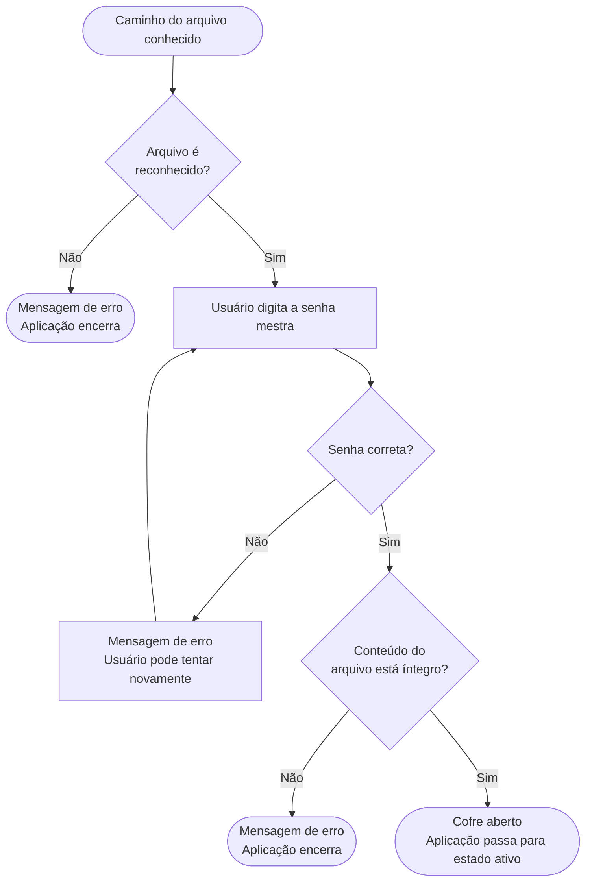
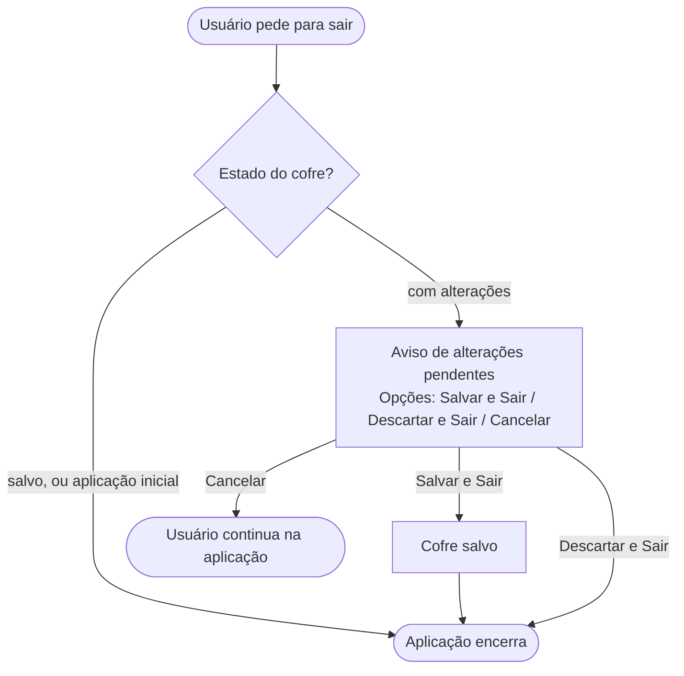

# Fluxos de Tarefas — Abditum

Este documento descreve como o usuário realiza as principais tarefas na aplicação, do ponto de vista da experiência — o que o usuário vê, o que ele faz e o que acontece como resultado.

Detalhes de implementação de UI são intencionalmente omitidos.

---

## Conceitos de Navegação

Para entender os fluxos de usuário, é importante contextualizar como a interação ocorre na interface TUI do Abditum. A aplicação sempre opera dentro de um **Contexto de Navegação**, que é definido por um **Container**, e foca em **Elementos em Foco** específicos.

### Contexto de Navegação

O Contexto de Navegação refere-se à área principal da interface com a qual o usuário está interagindo ativamente. Ele determina quais elementos estão visíveis, quais ações são possíveis e qual subconjunto de dados do cofre está sendo apresentado. O usuário navega entre diferentes contextos para realizar suas tarefas (ex: da lista de segredos para a edição de um segredo).

O contexto é fortemente guiado pelo **Container** que está ativo no momento. Um Container é um componente da interface que agrupa e gerencia uma coleção de elementos (como uma lista de pastas, uma lista de segredos, ou um formulário de edição).

O **Estado Lógico do Container** é fundamental:
*   **Container Editável**: Permite ações de modificação (ex: adicionar novo elemento, editar elementos existentes, renomear).
*   **Container Somente Leitura**: Restringe as ações a operações de consulta (ex: pesquisar, copiar valor, visualizar detalhes), impedindo edições ou criações diretas. Um exemplo seria a pasta virtual "Favoritos", que exibe segredos, mas não permite criá-los ou movê-los diretamente nela.

As ações disponíveis na TUI (como "pesquisar", "incluir novo elemento") são tipicamente associadas ao Container ativo e ao seu estado lógico.

### Elementos em Foco

Dentro de um Contexto de Navegação e do Container ativo, um **elemento em foco** (ou simplesmente "em foco") é o item atualmente destacado para interação. O foco é uma referência ao elemento individual que está pronto para receber uma ação do usuário (ex: abrir, editar, mover, copiar). Em uma TUI, geralmente há apenas um elemento em foco por vez na área ativa, guiando a interação do usuário.

Ações específicas sobre o elemento em foco também são condicionadas pelo Container pai:
*   Se o **Segredo em Foco** está em um **Container Editável** (ex: lista de segredos de uma pasta real), ações como "editar segredo" ou "marcar para exclusão" são possíveis.
*   Se o **Segredo em Foco** está em um **Container Somente Leitura** (ex: pasta virtual "Favoritos"), as ações podem se limitar a "copiar valor de campo" ou "visualizar detalhes", mas não "editar" ou "excluir".
*   Similarmente, se o **Campo em Foco** está em um formulário de edição dentro de um **Container Editável**, o campo pode ser modificado. Se estiver em uma visualização somente leitura (ex: um segredo na pasta "Favoritos"), apenas a cópia do valor pode ser permitida.

Exemplos de elementos que podem estar em foco:

*   **Pasta em Foco**: A pasta atualmente selecionada ou "aberta" na árvore de navegação. Suas subpastas e segredos são exibidos.
*   **Segredo em Foco**: O segredo atualmente selecionado em uma lista.
*   **Campo em Foco**: Em telas de edição ou visualização de segredos, um campo específico (ex: "Usuário", "Senha", "Observação").
*   **Opção em Foco**: Em menus, caixas de diálogo ou listas de opções, a opção atualmente destacada para seleção.

A manipulação do foco, em conjunto com o estado do Container, é central para a experiência na TUI, permitindo que o usuário interaja de forma eficiente com os elementos visíveis e limitando as ações às permissões lógicas do contexto atual.

## Pré-condições

Cada fluxo declara as pré-condições necessárias para que ele possa iniciar. As pré-condições descrevem o **estado do mundo** no momento em que o fluxo começa — não o caminho percorrido para chegar lá. Um mesmo estado pode ser alcançado por múltiplos caminhos, e o fluxo não depende de qual foi.

As dimensões de estado que podem aparecer nas pré-condições são:

### Estado da aplicação
| Estado | Descrição |
|--------|-----------|
| `inicial` | Nenhum cofre carregado |
| `ativo` | Cofre aberto e acessível |

### Estado do cofre
Só existe quando a aplicação está `ativa`.

| Estado | Descrição |
|--------|-----------|
| `salvo` | Conteúdo em memória coincide com o arquivo em disco |
| `com alterações` | Há mudanças não salvas desde a última gravação |
| `divergente` | O arquivo em disco foi modificado externamente desde a última leitura ou gravação |

### Estado de navegação
Só existe quando a aplicação está `ativa`.

| Dimensão | Valores possíveis |
|----------|------------------|
| Pasta em foco | Uma pasta (sempre existe — no mínimo a Pasta Geral está em foco) |
| Segredo em foco | Um segredo, ou nenhum |

### Estado do segredo
Conforme definido em `modelo-dominio.md`. Relevante como pré-condição quando um segredo está em foco.

| Estado | Descrição |
|--------|-----------|
| `original` | Carregado do arquivo sem alterações na sessão |
| `incluido` | Criado durante a sessão, ainda não gravado |
| `modificado` | Existia no arquivo e foi alterado na sessão |
| `excluido` | Marcado para remoção ao salvar |

---

**Convenções:**
- Os fluxos são descritos como uma sequência de passos lógicos.
- Condicionais são indicadas por **"Se... então..."**.
- Referências a outros fluxos estão em **negrito**.

---

## Fluxo 1 — Iniciar a Aplicação

**Pré-condição:** aplicação em estado `inicial`.

1. O usuário executa o binário.
2. **Se** um argumento de arquivo foi fornecido:
    - **Se** o arquivo existe: prossegue para o **Fluxo 2 — Abrir Cofre**.
    - **Se** o arquivo não existe: exibe mensagem de erro e a aplicação encerra.
3. **Se** nenhum argumento foi fornecido:
    - Exibe tela de boas-vindas com opções "Criar novo cofre" e "Abrir cofre existente".
    - **Se** o usuário escolhe criar: prossegue para o **Fluxo 3 — Criar Novo Cofre**.
    - **Se** o usuário escolhe abrir: solicita o caminho do arquivo e prossegue para o **Fluxo 2 — Abrir Cofre**.

---

## Fluxo 2 — Abrir Cofre Existente

**Pré-condição:** aplicação em estado `inicial` + caminho de arquivo conhecido.

O caminho pode ter chegado de qualquer forma: argumento de linha de comando, escolha na tela de boas-vindas, ou retorno de um bloqueio (neste caso o caminho já vem preenchido com o arquivo que estava aberto).

**O que o usuário vê e faz:**

- Vê o caminho do arquivo que será aberto e um campo para digitar a senha mestra.
- Quando retorna de um bloqueio: o caminho já está preenchido — o usuário só precisa digitar a senha.
- Se a senha estiver errada: recebe uma mensagem genérica de erro e pode tentar novamente, sem limite de tentativas.
- Se o arquivo estiver corrompido ou inválido: recebe uma mensagem genérica de erro e a aplicação encerra.
- Se tudo estiver correto: o cofre é aberto e o usuário vê sua estrutura de pastas e segredos.

**Nota:** mensagens de erro são sempre genéricas — a aplicação não informa se o problema foi a senha ou a integridade do arquivo.

---

## Fluxo 3 — Criar Novo Cofre

**Pré-condição:** aplicação em estado `inicial`.

**O que o usuário vê e faz:**

- Informa onde quer salvar o arquivo do cofre (caminho e nome). A extensão `.abditum` é adicionada automaticamente se omitida.
- Define a senha mestra digitando-a duas vezes. Se as duas entradas não coincidem, é avisado e recomeça.
- Se a senha for considerada fraca, recebe um aviso informativo com os critérios não atendidos. Pode optar por prosseguir mesmo assim ou revisar — a decisão é do usuário.
- Após confirmar, o cofre é criado e gravado em disco imediatamente. O usuário já vê a estrutura inicial: Pasta Geral com as subpastas "Sites e Apps" e "Financeiro", e os modelos padrão (Login, Cartão de Crédito, Chave de API).

---

## Fluxo 4 — Sair da Aplicação

**Pré-condição:** nenhuma — o usuário pode pedir para sair a qualquer momento.

**O que o usuário vê e faz:**

- Se não há alterações pendentes (ou a aplicação está em estado `inicial`): encerra diretamente, sem confirmação.
- Se há alterações não salvas: é avisado e escolhe entre salvar antes de sair, descartar as alterações e sair, ou cancelar e continuar.
- Ao encerrar por qualquer caminho, a tela é limpa antes de devolver o controle ao terminal.

**O que o usuário vê e faz:**

- Se não há alterações pendentes (ou a aplicação está em estado `inicial`): encerra diretamente, sem confirmação.
- Se há alterações não salvas: é avisado e escolhe entre salvar antes de sair, descartar as alterações e sair, ou cancelar e continuar.
- Ao encerrar por qualquer caminho, a tela é limpa antes de devolver o controle ao terminal.

