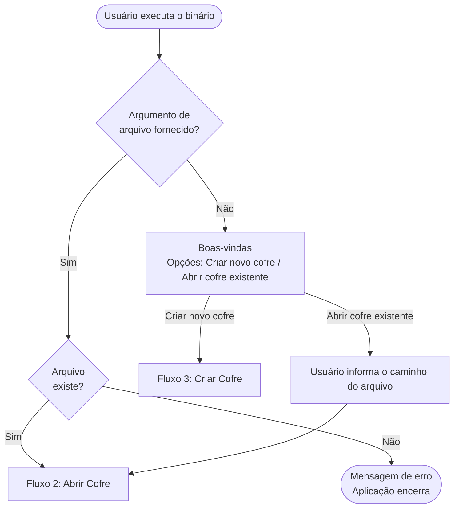
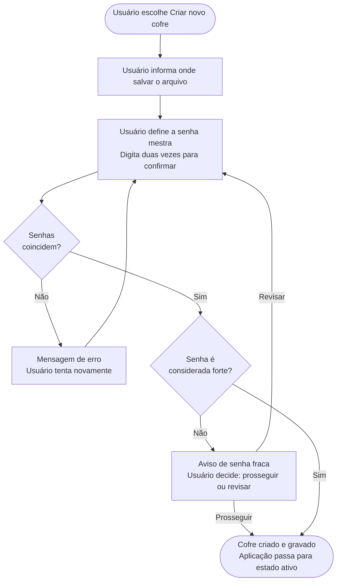

# Fluxos de Tarefas — Abditum

Este documento descreve como o usuário realiza as principais tarefas na aplicação, do ponto de vista da experiência — o que o usuário vê, o que ele faz e o que acontece como resultado.

Detalhes de implementação de UI são intencionalmente omitidos.

---

## Pré-condições

Cada fluxo declara as pré-condições necessárias para que ele possa iniciar. As pré-condições descrevem o **estado do mundo** no momento em que o fluxo começa — não o caminho percorrido para chegar lá. Um mesmo estado pode ser alcançado por múltiplos caminhos, e o fluxo não depende de qual foi.

As dimensões de estado que podem aparecer nas pré-condições são:

### Estado da aplicação
| Estado | Descrição |
|--------|-----------|
| `inicial` | Nenhum cofre carregado |
| `ativo` | Cofre aberto e acessível |

### Estado do cofre
Só existe quando a aplicação está `ativa`.

| Estado | Descrição |
|--------|-----------|
| `salvo` | Conteúdo em memória coincide com o arquivo em disco |
| `com alterações` | Há mudanças não salvas desde a última gravação |
| `divergente` | O arquivo em disco foi modificado externamente desde a última leitura ou gravação |

### Estado de navegação
Só existe quando a aplicação está `ativa`.

| Dimensão | Valores possíveis |
|----------|------------------|
| Pasta em foco | Uma pasta (sempre existe — no mínimo a Pasta Geral está em foco) |
| Segredo em foco | Um segredo, ou nenhum |

### Estado do segredo
Conforme definido em `modelo-dominio.md`. Relevante como pré-condição quando um segredo está em foco.

| Estado | Descrição |
|--------|-----------|
| `original` | Carregado do arquivo sem alterações na sessão |
| `incluido` | Criado durante a sessão, ainda não gravado |
| `modificado` | Existia no arquivo e foi alterado na sessão |
| `excluido` | Marcado para remoção ao salvar |

---

**Convenções dos diagramas:**
- Retângulos → momentos da interação
- Losangos → decisões ou ramificações
- Retângulos arredondados → término do fluxo
- Texto nas setas → ação do usuário ou condição do sistema

---

## Fluxo 1 — Iniciar a Aplicação

**Pré-condição:** aplicação em estado `inicial`.

Ao executar o binário, o comportamento depende de como ele foi invocado.

**O que o usuário vê e faz:**

- Se não informou arquivo: vê uma tela de boas-vindas com duas opções — criar um cofre novo ou abrir um existente.
- Se escolhe abrir: informa o caminho do arquivo `.abditum` que deseja abrir.
- Se informou o arquivo diretamente ao executar: a aplicação já vai direto para a autenticação, sem passar pela tela de boas-vindas.
- Se o arquivo informado não existe: recebe uma mensagem de erro e a aplicação encerra.

---

## Fluxo 2 — Abrir Cofre Existente

**Pré-condição:** aplicação em estado `inicial` + caminho de arquivo conhecido.

O caminho pode ter chegado de qualquer forma: argumento de linha de comando, escolha na tela de boas-vindas, ou retorno de um bloqueio (neste caso o caminho já vem preenchido com o arquivo que estava aberto).

**O que o usuário vê e faz:**

- Vê o caminho do arquivo que será aberto e um campo para digitar a senha mestra.
- Quando retorna de um bloqueio: o caminho já está preenchido — o usuário só precisa digitar a senha.
- Se a senha estiver errada: recebe uma mensagem genérica de erro e pode tentar novamente, sem limite de tentativas.
- Se o arquivo estiver corrompido ou inválido: recebe uma mensagem genérica de erro e a aplicação encerra.
- Se tudo estiver correto: o cofre é aberto e o usuário vê sua estrutura de pastas e segredos.

**Nota:** mensagens de erro são sempre genéricas — a aplicação não informa se o problema foi a senha ou a integridade do arquivo.

---

## Fluxo 3 — Criar Novo Cofre

**Pré-condição:** aplicação em estado `inicial`.

**O que o usuário vê e faz:**

- Informa onde quer salvar o arquivo do cofre (caminho e nome). A extensão `.abditum` é adicionada automaticamente se omitida.
- Define a senha mestra digitando-a duas vezes. Se as duas entradas não coincidem, é avisado e recomeça.
- Se a senha for considerada fraca, recebe um aviso informativo com os critérios não atendidos. Pode optar por prosseguir mesmo assim ou revisar — a decisão é do usuário.
- Após confirmar, o cofre é criado e gravado em disco imediatamente. O usuário já vê a estrutura inicial: Pasta Geral com as subpastas "Sites e Apps" e "Financeiro", e os modelos padrão (Login, Cartão de Crédito, Chave de API).

---

## Fluxo 4 — Sair da Aplicação

**Pré-condição:** nenhuma — o usuário pode pedir para sair a qualquer momento.

**O que o usuário vê e faz:**

- Se não há alterações pendentes (ou a aplicação está em estado `inicial`): encerra diretamente, sem confirmação.
- Se há alterações não salvas: é avisado e escolhe entre salvar antes de sair, descartar as alterações e sair, ou cancelar e continuar.
- Ao encerrar por qualquer caminho, a tela é limpa antes de devolver o controle ao terminal.
