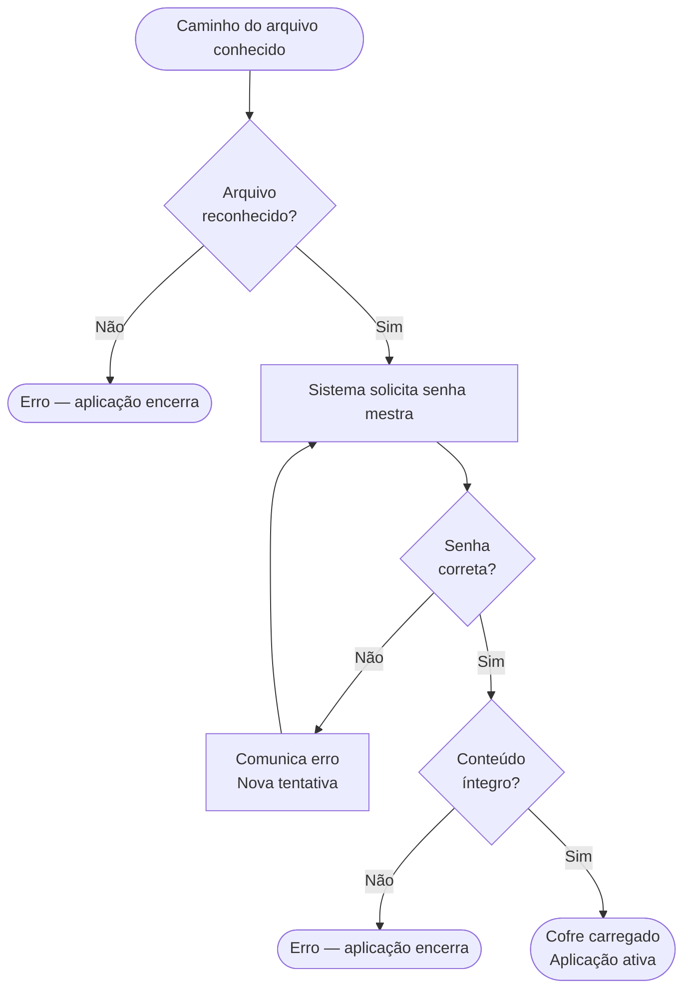
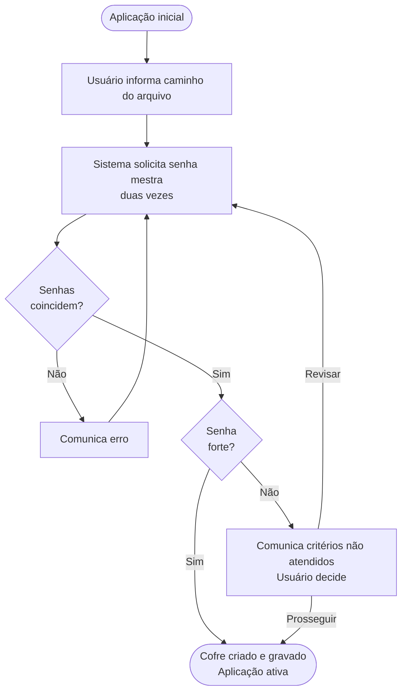

# Fluxos de Tarefas — Abditum

Este documento descreve como o usuário realiza as principais tarefas na aplicação, do ponto de vista da experiência — o que o usuário faz e o que acontece como resultado.

## Princípios deste documento

### Independência de UI

Os fluxos são descritos de forma **independente de qualquer solução de UI**. Isso significa que uma mesma interação pode ser realizada por uma tela dedicada, uma aba, um painel expandido, ou qualquer outro mecanismo — e o fluxo permanece válido. A decisão de como realizar cada interação na UI é tomada separadamente, durante a implementação.

Por isso, o vocabulário é cuidadosamente neutro. Palavras como "exibe", "mostra", "campo", "tela" carregam conotações de UI e são evitadas. Em seu lugar:

| Em vez de... | Usamos... |
|---|---|
| "exibe um campo para" | "o sistema solicita" |
| "digita no campo" | "o usuário informa" |
| "mostra uma mensagem" | "o sistema comunica" |
| "seleciona numa lista" | "o usuário escolhe entre" |

### Fluxos como especificação

Os fluxos são **especificação do comportamento esperado**, não documentação posterior. Foram escritos e validados antes da implementação para que a IA implementadora não precise presumir comportamentos — cada decisão de UX já está registrada aqui.

---

## Conceitos de contexto e navegação

Para descrever com precisão quando um fluxo pode ser iniciado, usamos o conceito de **contexto**: o conjunto de condições que são verdadeiras no momento em que o fluxo começa. O contexto descreve *o estado do mundo*, não o caminho percorrido para chegar lá. Um mesmo contexto pode ser alcançado por múltiplos caminhos, e o fluxo não depende de qual foi.

O contexto de um fluxo é composto por algumas dimensões:

### Estado da aplicação

| Estado | Descrição |
|--------|-----------|
| `inicial` | Nenhum cofre carregado |
| `ativo` | Cofre aberto e acessível |

### Estado do cofre

Só existe quando a aplicação está `ativa`.

| Estado | Descrição |
|--------|-----------|
| `salvo` | Conteúdo em memória coincide com o arquivo em disco |
| `com alterações` | Há mudanças não salvas desde a última gravação |
| `divergente` | O arquivo em disco foi modificado externamente desde a última leitura ou gravação |

### Foco e navegação

Só existe quando a aplicação está `ativa`. O foco indica o elemento que é o **assunto do momento** — independente de como o usuário chegou até ele. Há uma hierarquia de foco: cada nível implica os anteriores.

| Nível | Descrição |
|-------|-----------|
| **pasta em foco** | Uma pasta é o assunto do momento. Sempre existe — no mínimo a Pasta Geral está em foco |
| **segredo em foco** | Um ou mais segredos são o assunto do momento. Ou nenhum |
| **segredo aberto** | O conteúdo de um segredo está sendo apresentado. Implica que o segredo também está em foco |
| **campo em foco** | Um campo específico dentro de um segredo aberto é o assunto do momento. Implica segredo aberto |

### Modo

O modo descreve o **comportamento do entorno** no momento — o que é possível fazer com o que está em foco. Os modos serão identificados e nomeados à medida que os fluxos forem descritos.

### Estado do segredo

Conforme definido em `modelo-dominio.md`. Relevante como contexto quando um segredo está em foco.

| Estado | Descrição |
|--------|-----------|
| `original` | Carregado do arquivo sem alterações na sessão |
| `incluido` | Criado durante a sessão, ainda não gravado |
| `modificado` | Existia no arquivo e foi alterado na sessão |
| `excluido` | Marcado para remoção ao salvar |

---

## Estrutura de cada fluxo

Cada fluxo é composto por:

- **Contexto necessário** — o que precisa ser verdade para o fluxo poder iniciar
- **Passos** — a sequência de interações, com ramificações explícitas
- **Contexto resultante** — o que muda ao final de cada caminho de saída do fluxo
- **Diagrama** — representação visual opcional, incluída quando o fluxo tem ramificações complexas que se beneficiam de uma visão panorâmica

---

## Fluxo 1 — Iniciar a Aplicação

**Contexto necessário:** aplicação em estado `inicial`.

**Passos:**

1. O usuário executa o binário.
2. Se um caminho de arquivo foi fornecido como argumento:
   - Se o arquivo existe → prossegue para o **Fluxo 2: Abrir Cofre**.
   - Se o arquivo não existe → o sistema comunica o erro e a aplicação encerra.
3. Se nenhum argumento foi fornecido → o sistema apresenta as opções: criar novo cofre ou abrir cofre existente.
   - Se o usuário escolhe criar → prossegue para o **Fluxo 3: Criar Novo Cofre**.
   - Se o usuário escolhe abrir → o usuário informa o caminho do arquivo e prossegue para o **Fluxo 2: Abrir Cofre**.

**Contexto resultante:**
- Arquivo não encontrado → aplicação encerrada.
- Usuário escolhe criar → contexto do **Fluxo 3**.
- Usuário informa caminho → contexto do **Fluxo 2**.

---

## Fluxo 2 — Abrir Cofre Existente

**Contexto necessário:** aplicação em estado `inicial` + caminho de arquivo conhecido.

O caminho pode ter chegado de qualquer forma: argumento de linha de comando, escolha no Fluxo 1, ou retorno de um bloqueio — neste último caso o caminho já está preenchido com o arquivo que estava aberto anteriormente.

**Passos:**

1. O sistema verifica se o arquivo é reconhecido como um cofre válido.
   - Se não for reconhecido → o sistema comunica o erro e a aplicação encerra. Sem nova tentativa.
2. O sistema solicita a senha mestra. O usuário a informa.
3. O sistema verifica a senha.
   - Se a senha estiver incorreta → o sistema comunica o erro. O usuário pode tentar novamente. Volta ao passo 2.
4. O sistema verifica a integridade do conteúdo do arquivo.
   - Se o conteúdo estiver corrompido → o sistema comunica o erro e a aplicação encerra. Sem nova tentativa.
5. O cofre é carregado. A aplicação passa para estado `ativo`.

**Contexto resultante:**
- Arquivo não reconhecido → aplicação encerrada.
- Conteúdo corrompido → aplicação encerrada.
- Sucesso → aplicação `ativa`, cofre `salvo`, pasta Geral em foco.

**Nota:** as mensagens de erro são sempre genéricas — o sistema não informa se o problema foi a senha ou a integridade do arquivo.

---

## Fluxo 3 — Criar Novo Cofre

**Contexto necessário:** aplicação em estado `inicial`.

**Passos:**

1. O usuário informa onde salvar o arquivo do cofre (caminho e nome). A extensão `.abditum` é adicionada automaticamente se omitida.
2. O sistema solicita a senha mestra. O usuário a informa duas vezes para confirmação.
3. O sistema verifica se as duas entradas coincidem.
   - Se não coincidem → o sistema comunica o erro. O usuário tenta novamente. Volta ao passo 2.
4. O sistema avalia a força da senha.
   - Se a senha for considerada fraca → o sistema comunica os critérios não atendidos e solicita uma decisão: prosseguir mesmo assim ou revisar a senha.
     - Se o usuário escolhe revisar → volta ao passo 2.
     - Se o usuário escolhe prosseguir → continua para o passo 5.
5. O cofre é criado com a estrutura inicial e gravado em disco. A aplicação passa para estado `ativo`.

**Contexto resultante:**
- Sucesso → aplicação `ativa`, cofre `salvo`, pasta Geral em foco. Estrutura inicial presente: Pasta Geral com subpastas "Sites e Apps" e "Financeiro"; modelos padrão Login, Cartão de Crédito e Chave de API.

---

## Fluxo 4 — Sair da Aplicação

**Contexto necessário:** nenhum — o usuário pode solicitar sair a qualquer momento.

**Passos:**

1. O usuário solicita sair.
2. O sistema verifica o estado do cofre.
   - Se a aplicação está em estado `inicial` ou o cofre está `salvo` → a aplicação encerra. Fim.
   - Se o cofre está `com alterações` → o sistema comunica que há alterações não salvas e solicita uma decisão: salvar e sair, descartar e sair, ou cancelar.
     - Se o usuário escolhe salvar e sair → o cofre é salvo e a aplicação encerra.
     - Se o usuário escolhe descartar e sair → a aplicação encerra sem salvar.
     - Se o usuário escolhe cancelar → o fluxo é interrompido e nada muda.

**Contexto resultante:**
- Salvar e sair → aplicação encerrada.
- Descartar e sair → aplicação encerrada.
- Cancelar → contexto inalterado (igual ao contexto necessário).
- Se o salvamento falhar → o sistema comunica o erro e a aplicação permanece aberta.
