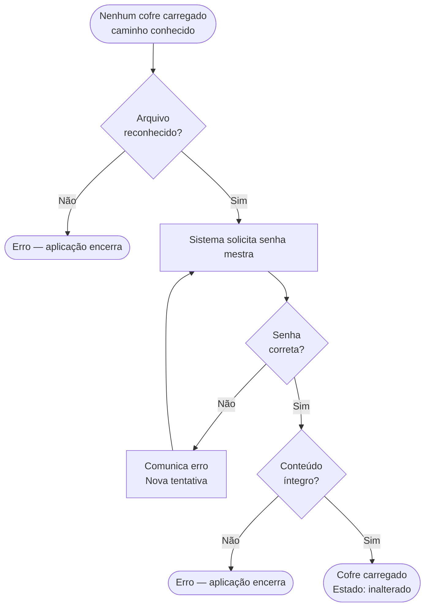

# Fluxos de Tarefas — Abditum

Este documento descreve como o usuário realiza as principais tarefas na aplicação, do ponto de vista da experiência — o que o usuário faz e o que acontece como resultado.

---

## Princípios deste documento

### Independência de UI

Os fluxos são descritos de forma **independente de qualquer solução de UI**. Isso significa que uma mesma interação pode ser realizada por uma tela dedicada, uma aba, um painel expandido, ou qualquer outro mecanismo — e o fluxo permanece válido. A decisão de como realizar cada interação na UI é tomada separadamente, durante a implementação.

Por isso, o vocabulário é cuidadosamente neutro. Palavras como "exibe", "mostra", "campo", "tela" carregam conotações de UI e são evitadas. Em seu lugar:

| Em vez de... | Usamos... |
|---|---|
| "exibe um campo para" | "o sistema solicita" |
| "digita no campo" | "o usuário informa" |
| "mostra uma mensagem" | "o sistema comunica" |
| "seleciona numa lista" | "o usuário escolhe entre" |

### Fluxos como especificação

Os fluxos são **especificação do comportamento esperado**, não documentação posterior. São escritos e validados antes da implementação, para que cada decisão de UX seja explícita e não deixe margem para presunções durante a codificação.

## Relação com Outros Documentos

Este documento descreve **fluxos**, que diferem de outros tipos de especificação usados no projeto:

### Casos de Uso vs. Fluxos

**Casos de uso** descrevem o que o sistema faz do ponto de vista de um ator. São orientados a objetivo — exemplos: "Abrir cofre", "Criar segredo". Não descrevem como, sequência de passos, ou erros em detalhe. São um inventário de capacidades.

**Fluxos** descrevem como o usuário realiza uma tarefa do início ao fim, incluindo decisões, ramificações e resultados. São orientados à experiência — cobrem caminho feliz e caminhos alternativos numa narrativa unificada.

### Cenários de BDD vs. Fluxos

**Cenários de BDD** (Given/When/Then) descrevem exemplos concretos e verificáveis de um comportamento específico. São orientados a teste — cada cenário é uma afirmação que passa ou falha. Exemplo: "Dado que o cofre está aberto e o segredo está em foco, quando o usuário marca para exclusão, então o segredo mostra indicador de excluído."

**Fluxos** são mais amplos. Um único fluxo desdobra-se em múltiplos cenários de BDD, cada um cobrindo uma ramificação ou condição específica. O fluxo é a narrativa; cenários são testes dessa narrativa.

### Relação de Granularidade

Os três documentos descrevem o mesmo sistema com propósitos diferentes, produzindo uma relação hierárquica:

- **Casos de uso → Fluxos**: o fluxo expande o caso de uso. Onde o caso de uso diz "o sistema abre o cofre", o fluxo detalha passo por passo, incluindo decisões e ramificações.

- **Fluxos → Cenários BDD**: cada caminho do fluxo é um cenário candidato. Um fluxo com três saídas possíveis gera ao menos 3 cenários BDD.

- **Cenários BDD ← Fluxos**: cenários extraem fatias singulares e verificáveis da narrativa mais ampla do fluxo.

Em termos de granularidade: **casos de uso ⊂ fluxos ⊂ cenários BDD**. Cada um é uma lente diferente — *inventário de capacidades*, *experiência completa*, *verificação automática*.

---

## Conceitos de contexto

Para descrever com precisão quando um fluxo pode ser iniciado, usamos o conceito de **contexto**: o conjunto de condições verdadeiras no momento em que o fluxo começa. O contexto descreve *o estado do mundo*, não o caminho percorrido. Um mesmo estado pode ser alcançado por múltiplos caminhos, e o fluxo comporta-se identicamente.

O contexto é composto por cinco dimensões: **foco**, **entorno**, **modo**, **estado da aplicação** e **estado das entidades**. As três primeiras são conceitos abstratos de navegação; as duas últimas são o estado concreto dos dados.

### Foco

O **foco** é o elemento que é o *assunto do momento* — aquilo com o qual o usuário está trabalhando no instante em que o fluxo é iniciado. O foco deve ser compreendido de forma completamente independente de como o usuário chegou até ele: dois caminhos diferentes podem levar ao mesmo foco, e uma vez lá, o fluxo se comporta de forma idêntica.

**Nota importante:** pode não haver um foco no momento. A interface pode estar visível (exibindo o entorno, opcões, elementos auxiliares) mas o usuário ainda não interagiu com nenhum elemento específico. Nesse caso, o contexto é descrito como "sem foco". Apenas quando o usuário realizar uma ação que coloca um elemento em foco é que esse elemento se torna parte do contexto.

#### Contexto implícito ao foco

Quando um elemento está em foco, outros elementos podem estar implicitamente em contexto também. São elementos fortemente relacionados — tão fortemente que um não se separa do outro. O contexto implícito não é uma decisão do designer; é uma consequência lógica da estrutura do sistema.

No caso mais concreto que temos — elementos em **hierarquia de árvore** — quando um elemento está em foco, seus ancestrais estão implicitamente em contexto também, porque um elemento não pode existir sem seu contentor. O pai é parte indissolúvel do contexto do filho.

O contexto implícito nunca é alterado explicitamente; é determinado automaticamente pela estrutura. Você não "coloca um ancestral em foco" — ele fica implicitamente em contexto porque seu descendente é o foco explícito.

**Nota importante:** o contexto implícito existe no nível lógico da especificação mas não necessariamente está visível para o usuário. Um ancestral pode estar em contexto sem que a UI o destaque visualmente. O que importa para os fluxos é que o contexto implícito existe logicamente, afetando quais ações são aplicáveis.

### Entorno

O **entorno** é o conjunto de elementos adicionais presentes no contexto — elementos de dados ou lógicos que facilitam as tarefas do usuário.

O entorno não é inerente ao sistema; é uma escolha do designer. É composto por elementos que não são o foco (o assunto principal) mas que estão presentes porque o foco existe. Podem ser: dados relacionados, opções disponíveis em função do foco, listas de candidatos, contexto histórico, condições de disponibilidade — toda informação que o designer escolhe tornar relevante.

**Importante:** o entorno é composto por elementos de dados e lógica, não elementos de UX. Como apresentar o entorno (qual tela, painel, menu) é decisão separada de design, feita posteriormente. O entorno descreve *o que está contextualmente relevante*, não *como é apresentado*.

Um mesmo foco pode ter unterschiedliche entornos conforme as decisões de design. O que importa para os fluxos é que o entorno influencia quais ações estão disponíveis — por isso faz parte do "contexto" — mas os fluxos permanecem válidos independentemente de como o entorno é implementado.

### Modo

O **modo** é um aspecto particular do entorno — tão relevante que merece menção separada.

Enquanto o entorno engloba todos os elementos contextuais adicionais (dados relacionados, opções, informações auxiliares), o modo descreve especificamente *como o entorno se comporta e que ações permite*. É o estado comportamental do entorno em relação ao foco: quais tipos de ações estão disponíveis, o que é possível fazer, como o entorno restringe ou habilita interações.

Exemplos de modos genéricos:

- **Visualização**: navegação e leitura, sem alteração de dados
- **Edição**: revisão e modificação de dados
- **Busca**: filtragem ou localização de elementos
- **Revisão**: análise de conteúdo antes de confirmar ou publicar

O modo é o aspecto do entorno mais diretamente relevante para determinar quais fluxos são aplicáveis. Um fluxo cujo contexto inclua um modo específico só pode ser iniciado quando esse modo está ativo — é por isso que merece destaque separado da dimensão geral "entorno".

### Contexto necessário

Cada fluxo declara qual contexto é necessário para ser iniciado. O contexto necessário é a soma das condições sobre:

- **Foco**: qual elemento (ou tipo) é o assunto
- **Modo**: qual comportamento está ativo
- **Estado da aplicação**: condições globais (documento carregado, aplicação conectada, etc.)
- **Estado das entidades**: condições sobre os dados (entidade marcada para exclusão, propriedade com valor específico, etc.)

Se o contexto necessário não for integralmente atendido, o fluxo não pode ser iniciado. Os controles que iniciam fluxos aparecem habilitados apenas quando o contexto necessário é atendido.

### Contexto resultante

O **contexto resultante** descreve quais condições serão verdadeiras após o fluxo terminar.

Um fluxo pode ter múltiplas saídas (sucesso, cancelamento, erro), cada com um contexto resultante diferente:

- **Sucesso** altera o estado da aplicação, das entidades, ou o foco
- **Cancelamento** geralmente restaura o contexto anterior
- **Erro** deixa o foco no local onde ocorreu, permitindo revisão

### Fluxo aplicável

Um fluxo é **aplicável** quando seu contexto necessário é integralmente atendido — significa que o usuário pode iniciá-lo agora.

Os controles que iniciam fluxos aparecem habilitados apenas para fluxos aplicáveis, criando uma experiência donde apenas ações viáveis são visíveis.

### Aplicação no Abditum

Neste documento, interpretamos esses conceitos abstratos concretamente:

- **Foco**: um cofre, pasta, segredo, ou campo dentro de segredo
- **Modo**: visualização, edição de valores, alteração de estrutura, busca
- **Contexto implícito**: a estrutura que contém o foco (pastas, cofre)
- **Estado da aplicação**: se há um cofre carregado, se foi alterado
- **Estado das entidades**: estado do segredo (original, incluído, modificado, excluído)

Todos os fluxos abaixo usam essa interpretação em seus contextos necessários e resultantes.

## Estados na aplicação

Esta seção especifica os estados concretos do Abditum, fundamentados nos conceitos de contexto descritos acima. Todos esses estados constituem o contexto no qual os fluxos acontecem.

### Estados das entidades

#### Estado do cofre

Só existe quando há um cofre carregado. Descreve a sincronização entre memória e disco.

| Estado | Descrição |
|--------|-----------|
| `inalterado` | Conteúdo em memória coincide com o arquivo em disco |
| `alterado` | Há mudanças não salvas na memória desde a última gravação ou criação |

#### Estado do segredo

Conforme definido em `modelo-dominio.md`. Relevante quando um segredo está em foco.

| Estado | Descrição |
|--------|-----------|
| `original` | Carregado do arquivo sem alterações na sessão |
| `incluido` | Criado durante a sessão, ainda não gravado |
| `modificado` | Existia no arquivo e foi alterado na sessão |
| `excluido` | Marcado para remoção ao salvar |

### Estados de navegação

#### Foco

Só existe quando há um cofre carregado. Descreve o elemento que é o assunto do momento, com uma hierarquia onde cada nível implica os anteriores.

| Nível | Descrição |
|-------|-----------|
| **pasta em foco** | Uma pasta é o assunto. Sempre existe — no mínimo a Pasta Geral está em foco |
| **segredo em foco** | Um ou mais segredos são o assunto. Pode não haver nenhum |
| **segredo aberto** | O conteúdo de um segredo está sendo apresentado. Implica segredo em foco |
| **campo em foco** | Um campo específico dentro de um segredo aberto é o assunto. Implica segredo aberto |

### Comportamentos do entorno

#### Modo do segredo

Define as ações possíveis quando um segredo está no entorno.

- **Visualização**: leitura do conteúdo; sem alteração de dados
- **Edição de valores**: revisão e modificação dos campos
- **Alteração de estrutura**: adição, remoção ou reordenação de campos

#### Modo do cofre

Define as ações possíveis ao trabalhar com o cofre como um todo.

- **Visualização/navegação**: navegar entre pastas e segredos
- **Busca**: filtragem de segredos por critério

---

## Estrutura de cada fluxo

Cada fluxo é composto por:

- **Contexto necessário** — o que precisa ser verdade para o fluxo poder iniciar
- **Passos** — a sequência de interações, com ramificações explícitas
- **Contexto resultante** — o que muda ao final de cada caminho de saída do fluxo
- **Diagrama** — representação visual opcional, incluída quando o fluxo tem ramificações que se beneficiam de uma visão panorâmica

---

## Fluxo 1 — Iniciar a Aplicação

**Contexto necessário:** nenhum cofre carregado.

**Passos:**

1. O usuário executa o binário.
2. Se um caminho de arquivo foi fornecido como argumento:
   - Se o arquivo existe → prossegue para o **Fluxo 2: Abrir Cofre**.
   - Se o arquivo não existe → o sistema comunica o erro e a aplicação encerra.
3. Se nenhum argumento foi fornecido → o sistema apresenta as opções: criar novo cofre ou abrir cofre existente.
   - Se o usuário escolhe criar → prossegue para o **Fluxo 3: Criar Novo Cofre**.
   - Se o usuário escolhe abrir → o usuário informa o caminho do arquivo e prossegue para o **Fluxo 2: Abrir Cofre**.

**Contexto resultante:**
- Arquivo não encontrado → aplicação encerrada.
- Usuário escolhe criar → contexto do **Fluxo 3**.
- Usuário informa caminho → contexto do **Fluxo 2**.

---

## Fluxo 2 — Abrir Cofre Existente

**Contexto necessário:** nenhum cofre carregado + caminho de arquivo conhecido.

O caminho pode ter chegado de qualquer forma: argumento de linha de comando, escolha no Fluxo 1, ou retorno de um bloqueio — neste último caso o caminho já está preenchido com o arquivo que estava aberto anteriormente.

**Passos:**

1. O sistema verifica se o arquivo é reconhecido como um cofre válido.
   - Se não for reconhecido → o sistema comunica o erro e a aplicação encerra. Sem nova tentativa.
2. O sistema solicita a senha mestra. O usuário a informa.
3. O sistema verifica a senha.
   - Se a senha estiver incorreta → o sistema comunica o erro. O usuário pode tentar novamente. Volta ao passo 2.
4. O sistema verifica a integridade do conteúdo do arquivo.
   - Se o conteúdo estiver corrompido → o sistema comunica o erro e a aplicação encerra. Sem nova tentativa.
5. O cofre é carregado.

**Contexto resultante:**
- Arquivo não reconhecido → aplicação encerrada.
- Conteúdo corrompido → aplicação encerrada.
- Sucesso → cofre `inalterado`, pasta Geral em foco.

**Nota:** as mensagens de erro são sempre genéricas — o sistema não informa se o problema foi a senha ou a integridade do arquivo.

---

## Fluxo 3 — Criar Novo Cofre

**Contexto necessário:** nenhum cofre carregado.

**Passos:**

1. O usuário informa onde salvar o arquivo do cofre (caminho e nome). A extensão `.abditum` é adicionada automaticamente se omitida.
2. O sistema solicita a senha mestra. O usuário a informa duas vezes para confirmação.
3. O sistema verifica se as duas entradas coincidem.
   - Se não coincidem → o sistema comunica o erro. O usuário tenta novamente. Volta ao passo 2.
4. O sistema avalia a força da senha.
   - Se a senha for considerada fraca → o sistema comunica os critérios não atendidos e solicita uma decisão: prosseguir mesmo assim ou revisar a senha.
     - Se o usuário escolhe revisar → volta ao passo 2.
     - Se o usuário escolhe prosseguir → continua para o passo 5.
5. O cofre é criado com a estrutura inicial e gravado em disco.

**Contexto resultante:**
- Sucesso → cofre `inalterado`, pasta Geral em foco. Estrutura inicial presente: Pasta Geral com subpastas "Sites e Apps" e "Financeiro"; modelos padrão Login, Cartão de Crédito e Chave de API.

---

## Fluxo 4 — Sair da Aplicação

**Contexto necessário:** nenhum — o usuário pode solicitar sair a qualquer momento.

**Passos:**

1. O usuário solicita sair.
2. Se não há cofre carregado, ou o cofre está `inalterado` → a aplicação encerra. Fim.
3. Se o cofre está `alterado` → o sistema comunica que há alterações não salvas e solicita uma decisão: salvar e sair, descartar e sair, ou cancelar.
   - Se o usuário escolhe salvar e sair → o cofre é salvo e a aplicação encerra.
   - Se o usuário escolhe descartar e sair → a aplicação encerra sem salvar.
   - Se o usuário escolhe cancelar → o fluxo é interrompido e nada muda.

**Contexto resultante:**
- Salvar e sair → aplicação encerrada.
- Descartar e sair → aplicação encerrada.
- Cancelar → contexto inalterado.
- Se o salvamento falhar → o sistema comunica o erro e o cofre permanece carregado.

---

