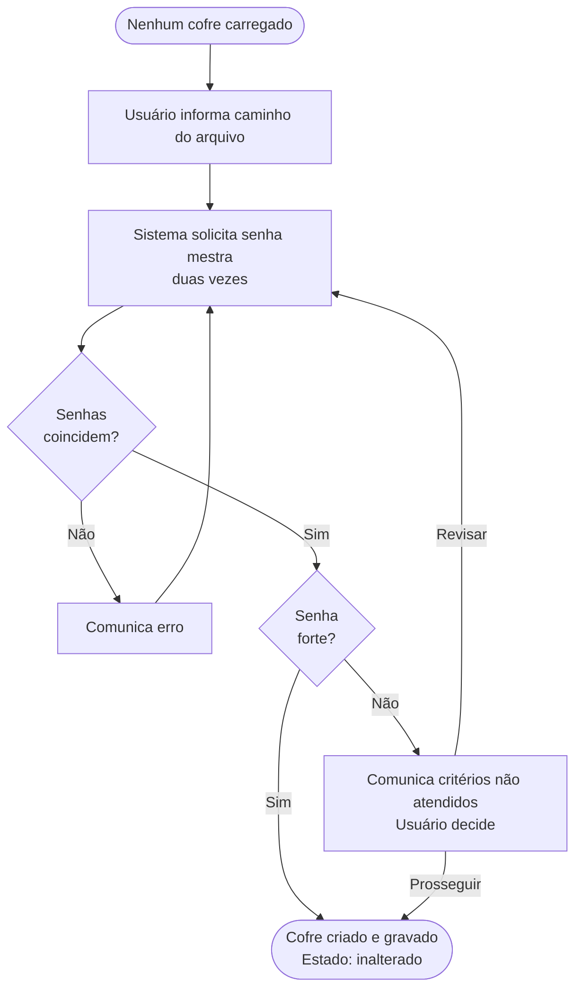

# Fluxos de Tarefas — Abditum

Este documento descreve como o usuário realiza as principais tarefas na aplicação, do ponto de vista da experiência — o que o usuário faz e o que acontece como resultado.

---

## Princípios deste documento

### Independência de UI

Os fluxos são descritos de forma **independente de qualquer solução de UI**. Isso significa que uma mesma interação pode ser realizada por uma tela dedicada, uma aba, um painel expandido, ou qualquer outro mecanismo — e o fluxo permanece válido. A decisão de como realizar cada interação na UI é tomada separadamente, durante a implementação.

Por isso, o vocabulário é cuidadosamente neutro. Palavras como "exibe", "mostra", "campo", "tela" carregam conotações de UI e são evitadas. Em seu lugar:

| Em vez de... | Usamos... |
|---|---|
| "exibe um campo para" | "o sistema solicita" |
| "digita no campo" | "o usuário informa" |
| "mostra uma mensagem" | "o sistema comunica" |
| "seleciona numa lista" | "o usuário escolhe entre" |

### Fluxos como especificação

Os fluxos são **especificação do comportamento esperado**, não documentação posterior. Foram escritos e validados antes da implementação para que a IA implementadora não precise presumir comportamentos — cada decisão de UX já está registrada aqui.

---

## Conceitos de contexto

Para descrever com precisão quando um fluxo pode ser iniciado, usamos o conceito de **contexto**: o conjunto de condições que são verdadeiras no momento em que o fluxo começa. O contexto descreve *o estado do mundo*, não o caminho percorrido para chegar lá. Um mesmo estado pode ser alcançado por múltiplos caminhos diferentes, e o fluxo se comporta da mesma forma independentemente de qual foi o caminho.

O contexto é composto por cinco dimensões: **foco**, **entorno**, **modo**, **estado da aplicação** e **estado das entidades**. As três primeiras são conceitos abstratos de navegação; as duas últimas são o estado concreto dos dados.

### Foco

O **foco** é o elemento que é o *assunto do momento* — aquilo com o qual o usuário está trabalhando. Exemplos: um cofre, uma pasta, um segredo, um campo dentro de um segredo.

O foco é independente de como o usuário chegou até ele. Dois caminhos diferentes podem levar ao mesmo foco, e uma vez lá, o comportamento é idêntico.

#### Foco implícito

Uma vez que um elemento está em foco, outros elementos relacionados estão implicitamente em foco também:

- Se um **segredo está em foco**, as **pastas que o contêm** estão implicitamente em foco
- Se uma **pasta está em foco**, o **cofre** está implicitamente em foco

O foco implícito nunca é alterado explicitamente — é determinado pela hierarquia da aplicação. Você não "coloca a pasta em foco"; ela fica implicitamente em foco porque o segredo que contém é o foco explícito.

### Entorno

O **entorno** é tudo aquilo que está indiretamente em atenção porque o foco existe. É o contexto visual ou lógico do foco — aquilo que o contém ou o rodeia.

**Exemplo:** quando um segredo está em foco, o entorno inclui a pasta que o contém, a estrutura de pastas acima dela, e o cofre em geral.

O entorno é **completamente independente de UI**. Uma lista de segredos pode ser apresentada como:
- Uma tela inteira
- Uma aba dentro de janelaprincipal
- Um painel lateral
- Uma árvore expandida com nós

Em todos os casos, o entorno é o mesmo: "lista de segredos dentro de uma pasta". A forma de apresentação é decidida durante o design da UI e não afeta a descrição do fluxo.

**Nota importante:** o contexto necessário de um fluxo não declara explicitamente qual é o entorno, porque o entorno é determinado pela UI. O que importa para o fluxo é apenas o que está em foco.

### Modo

O **modo** descreve o comportamento do entorno em relação ao foco — o que é possível fazer com o que está em foco.

Exemplos de modos:

- **Visualização**: o usuário pode navegar e visualizar, mas não alterar dados
- **Edição de valores**: o usuário pode revisar e modificar os valores dos campos
- **Alteração de estrutura**: o usuário pode adicionar, remover ou reordenar elementos
- **Busca**: o usuário está filtrando elementos por critério
- **Confirmação**: o usuário está sendo pedido para confirmar uma ação irreversível

O modo influencia diretamente quais fluxos estão disponíveis. Por exemplo, um fluxo para "editar valores do segredo" só é aplicável se o segredo está em modo de edição, não em modo de visualização.

### Contexto necessário

Cada fluxo declare qual contexto é necessário para que ele possa ser iniciado. Isso inclui:

- Qual é o **foco** (p.ex.: "um segredo está em foco")
- Qual é o **modo** (p.ex.: "segredo em modo de edição")
- Qual é o **estado da aplicação** (p.ex.: "cofre carregado")
- Qual é o **estado das entidades** (p.ex.: "o segredo não foi excluído")

Se o contexto necessário não for atendido, o fluxo não pode ser iniciado. As ações que iniciam o fluxo (botões, atalhos, menus) só são visíveis/habilitadas quando o contexto é atendido.

### Contexto resultante

Ao final de um fluxo, o contexto muda. O **contexto resultante** descreve quais condições serão verdadeiras depois que o fluxo terminar.

Um fluxo pode ter múltiplas saídas (sucesso, cancelamento, erro), e cada saída pode ter um contexto resultante diferente. Por exemplo:

- Se o usuário salva o cofre com sucesso → foco permanece igual, mas estado do cofre muda para "inalterado"
- Se o usuário cancela a operação → contexto permanece intacto, foco volta ao que era antes
- Se ocorre um erro → uma mensagem é apresentada, foco permanece no local do erro

### Fluxo aplicável

Um fluxo é **aplicável** no contexto atual se seu contexto necessário é atendido. Isso significa que o usuário pode iniciar esse fluxo agora.

Os controles de UI que iniciam fluxos (botões, menus, atalhos) só aparecem habilitados para fluxos aplicáveis, criando uma experiência onde "o que eu posso fazer agora está visível".

## Relação com Outros Documentos

Este documento descreve **fluxos**, que são diferentes de outros conceitos usados no projeto:

### Casos de Uso vs. Fluxos

**Casos de uso** descrevem o que o sistema faz do ponto de vista de um ator. São orientados a objetivo — "Abrir cofre", "Criar segredo". Não descrevem como, não descrevem a sequência de passos, não descrevem erros em detalhe. São um inventário de capacidades do sistema.

**Fluxos** descrevem como o usuário realiza uma tarefa do início ao fim, incluindo decisões, ramificações e resultados. São orientados à experiência — cobrem o caminho feliz e os caminhos alternativos num único documento narrativo.

### Cenários de BDD vs. Fluxos

**Cenários de BDD** (Given/When/Then) descrevem exemplos concretos e verificáveis de um comportamento específico. São orientados a teste — cada cenário é uma afirmação que pode passar ou falhar. Exemplo: "Dado que o cofre está aberto e o segredo está em foco, quando o usuário marca para exclusão, então o segredo aparece com indicador de excluído."

**Fluxos** são mais amplos. Um único fluxo pode ser desdobrado em múltiplos cenários de BDD, cada um cobrindo uma ramificação ou condição específica mencionada no fluxo. O fluxo é a narrativa; os cenários são testes dessa narrativa.

### Onde se Sobrepõem

Os três documentos falam sobre o mesmo sistema, então há sobreposição de assunto — mas não de propósito. A relação é hierárquica:

- **Um caso de uso vira um fluxo detalhado**: o fluxo é a expansão do caso de uso. O caso de uso diz "o sistema abre o cofre"; o fluxo diz exatamente como, passo por passo, incluindo decisões, erros e ramificações.

- **Um fluxo com ramificações vira vários cenários BDD**: cada caminho do fluxo é um cenário candidato. O fluxo "Abrir Cofre" tem três saídas possíveis (sucesso, senhaincorreta/tentativa novamente, arquivo corrompido), então gera ao menos 3 cenários BDD.

- **Um cenário BDD verifica um passo específico do fluxo**: os cenários são testes — fatias singulares e verificáveis extraídas da narrativa mais ampla do fluxo.

Em termos de granularidade: **casos de uso ⊂ fluxos ⊂ cenários BDD**. Cada um é uma lente diferente sobre o mesmo comportamento — a lente do *inventário de capacidades* (casos de uso), a lente da *experiência completa* (fluxos), e a lente da *verificação automática* (cenários).

## Estados na aplicação

### Estado do cofre

Só existe quando há um cofre carregado. Quando não há cofre carregado, essa dimensão simplesmente não existe.

| Estado | Descrição |
|--------|-----------|
| `inalterado` | Conteúdo em memória coincide com o arquivo em disco |
| `alterado` | Há mudanças não salvas  na memória desde a última gravação ou criação do arquivo |

### Estado do segredo

Conforme definido em `modelo-dominio.md`. Relevante como contexto quando um segredo está em foco.

| Estado | Descrição |
|--------|-----------|
| `original` | Carregado do arquivo sem alterações na sessão |
| `incluido` | Criado durante a sessão, ainda não gravado |
| `modificado` | Existia no arquivo e foi alterado na sessão |
| `excluido` | Marcado para remoção ao salvar |

### Foco

Só existe quando há um cofre carregado. O foco indica o elemento que é o **assunto do momento** — independente de como o usuário chegou até ele. Há uma hierarquia de foco: cada nível implica os anteriores.

| Nível | Descrição |
|-------|-----------|
| **pasta em foco** | Uma pasta é o assunto do momento. Sempre existe — no mínimo a Pasta Geral está em foco |
| **segredo em foco** | Um ou mais segredos são o assunto do momento. Ou nenhum |
| **segredo aberto** | O conteúdo de um segredo está sendo apresentado. Implica que o segredo também está em foco |
| **campo em foco** | Um campo específico dentro de um segredo aberto é o assunto do momento. Implica segredo aberto |

### Modo do segredo

Caso um segredo esteja no entorno, então esse entorno poderá estar:
- visualização
- edição de valores
- alteração de estrutura

### Modo do cofre

Caso o cofre esteja no entorno, então esse entorno poderá ser
 - visualização/navegação
 - em busca

---

## Estrutura de cada fluxo

Cada fluxo é composto por:

- **Contexto necessário** — o que precisa ser verdade para o fluxo poder iniciar
- **Passos** — a sequência de interações, com ramificações explícitas
- **Contexto resultante** — o que muda ao final de cada caminho de saída do fluxo
- **Diagrama** — representação visual opcional, incluída quando o fluxo tem ramificações que se beneficiam de uma visão panorâmica

---

## Fluxo 1 — Iniciar a Aplicação

**Contexto necessário:** nenhum cofre carregado.

**Passos:**

1. O usuário executa o binário.
2. Se um caminho de arquivo foi fornecido como argumento:
   - Se o arquivo existe → prossegue para o **Fluxo 2: Abrir Cofre**.
   - Se o arquivo não existe → o sistema comunica o erro e a aplicação encerra.
3. Se nenhum argumento foi fornecido → o sistema apresenta as opções: criar novo cofre ou abrir cofre existente.
   - Se o usuário escolhe criar → prossegue para o **Fluxo 3: Criar Novo Cofre**.
   - Se o usuário escolhe abrir → o usuário informa o caminho do arquivo e prossegue para o **Fluxo 2: Abrir Cofre**.

**Contexto resultante:**
- Arquivo não encontrado → aplicação encerrada.
- Usuário escolhe criar → contexto do **Fluxo 3**.
- Usuário informa caminho → contexto do **Fluxo 2**.

---

## Fluxo 2 — Abrir Cofre Existente

**Contexto necessário:** nenhum cofre carregado + caminho de arquivo conhecido.

O caminho pode ter chegado de qualquer forma: argumento de linha de comando, escolha no Fluxo 1, ou retorno de um bloqueio — neste último caso o caminho já está preenchido com o arquivo que estava aberto anteriormente.

**Passos:**

1. O sistema verifica se o arquivo é reconhecido como um cofre válido.
   - Se não for reconhecido → o sistema comunica o erro e a aplicação encerra. Sem nova tentativa.
2. O sistema solicita a senha mestra. O usuário a informa.
3. O sistema verifica a senha.
   - Se a senha estiver incorreta → o sistema comunica o erro. O usuário pode tentar novamente. Volta ao passo 2.
4. O sistema verifica a integridade do conteúdo do arquivo.
   - Se o conteúdo estiver corrompido → o sistema comunica o erro e a aplicação encerra. Sem nova tentativa.
5. O cofre é carregado.

**Contexto resultante:**
- Arquivo não reconhecido → aplicação encerrada.
- Conteúdo corrompido → aplicação encerrada.
- Sucesso → cofre `inalterado`, pasta Geral em foco.

**Nota:** as mensagens de erro são sempre genéricas — o sistema não informa se o problema foi a senha ou a integridade do arquivo.

---

## Fluxo 3 — Criar Novo Cofre

**Contexto necessário:** nenhum cofre carregado.

**Passos:**

1. O usuário informa onde salvar o arquivo do cofre (caminho e nome). A extensão `.abditum` é adicionada automaticamente se omitida.
2. O sistema solicita a senha mestra. O usuário a informa duas vezes para confirmação.
3. O sistema verifica se as duas entradas coincidem.
   - Se não coincidem → o sistema comunica o erro. O usuário tenta novamente. Volta ao passo 2.
4. O sistema avalia a força da senha.
   - Se a senha for considerada fraca → o sistema comunica os critérios não atendidos e solicita uma decisão: prosseguir mesmo assim ou revisar a senha.
     - Se o usuário escolhe revisar → volta ao passo 2.
     - Se o usuário escolhe prosseguir → continua para o passo 5.
5. O cofre é criado com a estrutura inicial e gravado em disco.

**Contexto resultante:**
- Sucesso → cofre `inalterado`, pasta Geral em foco. Estrutura inicial presente: Pasta Geral com subpastas "Sites e Apps" e "Financeiro"; modelos padrão Login, Cartão de Crédito e Chave de API.

---

## Fluxo 4 — Sair da Aplicação

**Contexto necessário:** nenhum — o usuário pode solicitar sair a qualquer momento.

**Passos:**

1. O usuário solicita sair.
2. Se não há cofre carregado, ou o cofre está `inalterado` → a aplicação encerra. Fim.
3. Se o cofre está `alterado` → o sistema comunica que há alterações não salvas e solicita uma decisão: salvar e sair, descartar e sair, ou cancelar.
   - Se o usuário escolhe salvar e sair → o cofre é salvo e a aplicação encerra.
   - Se o usuário escolhe descartar e sair → a aplicação encerra sem salvar.
   - Se o usuário escolhe cancelar → o fluxo é interrompido e nada muda.

**Contexto resultante:**
- Salvar e sair → aplicação encerrada.
- Descartar e sair → aplicação encerrada.
- Cancelar → contexto inalterado.
- Se o salvamento falhar → o sistema comunica o erro e o cofre permanece carregado.

---

