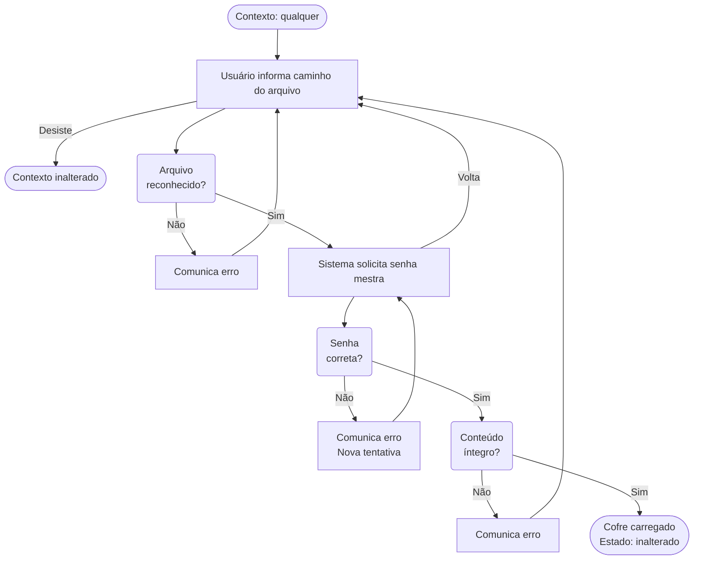
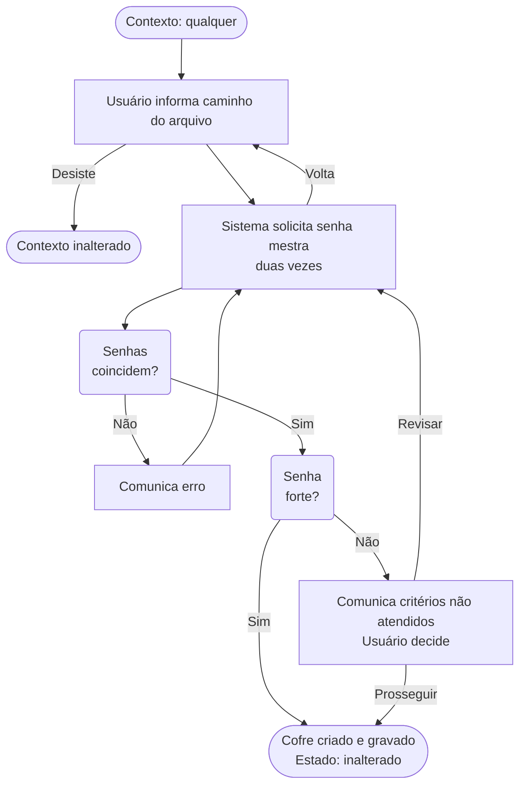

# Fluxos de Tarefas — Abditum

Este documento descreve como o usuário realiza as principais tarefas na aplicação, do ponto de vista da experiência — o que o usuário faz e o que acontece como resultado.

---

## Princípios deste documento

### Independência de UI

Os fluxos descrevem interações de forma **independente de qualquer solução de UI** — a decisão de como realizá-las na interface é tomada durante a implementação.

O vocabulário é cuidadosamente neutro:

| Em vez de... | Usamos... |
|---|---|
| "exibe um campo para" | "o sistema solicita" |
| "digita no campo" | "o usuário informa" |
| "mostra uma mensagem" | "o sistema comunica" |
| "seleciona numa lista" | "o usuário escolhe entre" |

### Fluxos como especificação

Os fluxos são **especificação do comportamento esperado**, escritos antes da implementação para que cada decisão de UX seja explícita.

---

## Relação com Outros Documentos

Este documento descreve **fluxos**, que diferem de outros tipos de especificação usados no projeto:

### Casos de Uso vs. Fluxos

**Casos de uso** descrevem *o que* o sistema faz do ponto de vista de um ator — um inventário de capacidades. Exemplos: "Abrir cofre", "Criar segredo". Não descrevem sequência, decisões ou erros.

**Fluxos** descrevem *como* o usuário realiza uma tarefa do início ao fim, com decisões, ramificações e resultados. Cobrem caminho feliz e caminhos alternativos numa narrativa unificada.

### Cenários de BDD vs. Fluxos

**Cenários de BDD** (Given/When/Then) descrevem exemplos concretos e verificáveis de um comportamento. São orientados a teste — cada cenário é uma afirmação que passa ou falha. Exemplo: "Dado que o cofre está aberto e o segredo está em foco, quando o usuário marca para exclusão, então o segredo mostra indicador de excluído."

**Fluxos** são mais amplos: um único fluxo desdobra-se em múltiplos cenários de BDD, cada um cobrindo uma ramificação ou condição específica. O fluxo é a narrativa; os cenários são testes dessa narrativa.

### Relação de Granularidade

Os três documentos descrevem o mesmo sistema com propósitos diferentes:

- **Casos de uso → Fluxos**: o fluxo expande o caso de uso, detalhando passo a passo, decisões e ramificações.
- **Fluxos → Cenários BDD**: cada caminho do fluxo é um cenário candidato. Um fluxo com três saídas possíveis gera ao menos 3 cenários BDD.

Cada um é uma lente diferente — *inventário de capacidades*, *experiência completa*, *verificação automática* — com granularidade crescente nessa ordem.

---

## Conceitos de contexto

O **contexto** é o conjunto de condições necessárias para um fluxo poder começar. Descreve *o estado lógico do sistema*, não o caminho percorrido pelo usuário — um mesmo **contexto** pode ser alcançado por múltiplos caminhos, e os fluxos se comportam de acordo com o **contexto**, independentemente de como se chegou a ele.

O contexto é composto por quatro dimensões de navegação — **foco**, **contexto implícito ao foco**, **entorno local** e **entorno global** —, ordenadas do mais específico ao mais abrangente. Cada dimensão é populada por elementos: objetos, entidades ou variáveis de estado. Não é só a presença do elemento que caracteriza o contexto, mas também o estado dos seus atributos.

### Foco

O **foco** é o *assunto do momento* no contexto — o elemento com o qual o usuário está trabalhando. É um conceito lógico, não visual, e independe de eventual destaque provido via UI. O foco também independe de como o usuário chegou até ele: dois caminhos diferentes podem levar ao mesmo foco, e o contexto apresentado para os fluxos será idêntico.

**Nota:** pode não haver foco. O contexto é então descrito pelas demais dimensões.

#### Contexto implícito ao foco

Quando um elemento está em foco, outros elementos fortemente acoplados a ele entram implicitamente no contexto — não por decisão do designer, mas por consequência lógica da estrutura do sistema. O contexto implícito não necessariamente está visível para o usuário.

No caso mais concreto — elementos em **hierarquia de árvore** — os ancestrais do elemento em foco estão sempre implicitamente em contexto, porque um elemento não pode existir sem seu container. O pai é parte indissolúvel do contexto do filho. O contexto implícito existe logicamente e afeta quais ações são aplicáveis, mesmo que a UI não o destaque visualmente.

### Entorno local

O **entorno local** é o conjunto de elementos que entram no contexto a partir de como a UI apresenta o estado lógico da aplicação.

Junto com essa apresentação, outros elementos podem compor o contexto. Dois exemplos concretos:

- **Modo de operação:** se o designer usa o mesmo formulário tanto para visualizar quanto para editar dados, o modo — visualização ou edição — torna-se parte do entorno local e determina quais ações estão disponíveis.
- **Dados de integração:** se a UI apresenta, ao lado do dado da aplicação, dados obtidos via integração externa para comparação, esses elementos também compõem o entorno local — e os fluxos que permitem escolher qual dado usar dependem de sua presença no contexto.

Os fluxos **não declaram o entorno local** nas pré-condições — ele é uma consequência do foco e das decisões de UI, resolvida durante o design.

#### Modo

O **modo** é uma variável de estado do entorno local especialmente relevante para os fluxos: determina quais ações estão disponíveis e, por isso, é frequentemente declarado como pré-condição — "modo visualização", "modo edição".

### Entorno global

O **entorno global** é o conjunto de elementos presentes no contexto durante toda a sessão, independentemente do foco.

Exemplo concreto: o usuário autenticado é entorno global em sistemas com conta — habilita fluxos como editar perfil, ver permissões e alterar senha a qualquer momento, independentemente do que estiver em foco.

### Contexto necessário no fluxo

Cada fluxo declara qual contexto é necessário para ser iniciado — combinando condições sobre foco, entorno global, modo e estado das entidades, usadas apenas quando relevantes ao fluxo. Se o contexto necessário não for integralmente atendido, o fluxo não pode ser iniciado.

### Contexto resultante

O **contexto resultante** descreve as condições que serão verdadeiras após o fluxo terminar. Um fluxo pode ter múltiplas saídas — sucesso, cancelamento, erro —, cada uma com um contexto resultante diferente.

### Fluxo elegível

Um fluxo é **elegível** quando seu contexto necessário é integralmente atendido — o usuário pode iniciá-lo agora. Os controles que iniciam fluxos aparecem habilitados apenas para fluxos elegíveis.

## Contexto no Abditum

Esta seção especifica os estados, níveis de foco e modos concretos do Abditum.

### Estado do cofre

Sincronização entre memória e disco — integra o entorno global da sessão. Só existe quando há um cofre carregado.

| Estado | Descrição |
|--------|-----------|
| `inalterado` | Conteúdo em memória coincide com o arquivo em disco |
| `alterado` | Há mudanças não salvas na memória desde a última gravação ou criação |

### Estado do segredo

Conforme definido em `modelo-dominio.md`. Costuma integrar o foco ou o entorno local.

| Estado | Descrição |
|--------|-------|
| `original` | Carregado do arquivo sem alterações na sessão |
| `incluido` | Criado durante a sessão, ainda não gravado |
| `modificado` | Existia no arquivo e foi alterado na sessão |
| `excluido` | Marcado para remoção ao salvar |

### Foco no Abditum

Quando há um cofre carregado, os focos recorrentes formam uma hierarquia onde cada nível implica os anteriores.

| Nível | Descrição |
|-------|-----------|
| **pasta em foco** | Uma pasta é o assunto. Sempre existe — no mínimo a Pasta Geral está em foco |
| **segredo em foco** | Um ou mais segredos são o assunto. Pode não haver nenhum |
| **segredo aberto** | O conteúdo de um segredo está sendo apresentado. Implica segredo em foco |
| **campo em foco** | Um campo específico dentro de um segredo aberto é o assunto. Implica segredo aberto |

### Modos no Abditum

#### Modo na apresentação do segredo

| Modo | Descrição |
|------|-----------|
| **Visualização** | Leitura do conteúdo; sem alteração de dados |
| **Edição de valores** | Revisão e modificação dos valores dos campos |
| **Alteração de estrutura** | Adição, remoção ou reordenação de campos |

#### Modo na apresentação do cofre

| Modo | Descrição |
|------|-----------|
| **Visualização/navegação** | Navegar entre pastas e segredos |
| **Busca** | Filtragem de segredos por critério |

---

## Estrutura de cada fluxo

Cada fluxo é composto por:

- **Contexto necessário** — o que precisa ser verdade para o fluxo poder iniciar
- **Passos** — a sequência de interações, com ramificações explícitas
- **Contexto resultante** — o que muda ao final de cada caminho de saída do fluxo
- **Diagrama** — representação visual opcional, incluída quando o fluxo tem ramificações que se beneficiam de uma visão panorâmica

---

## Fluxo 1 — Abrir Cofre Existente

**Contexto necessário:** nenhum. O fluxo é elegível independentemente de haver ou não um cofre carregado.

**Nota sobre a UX atual:** a interface não oferece o gesto de abrir cofre enquanto há um cofre carregado. Essa é uma restrição de UX, não do fluxo — o fluxo em si não impõe essa limitação.

**Entrada antecipada via argumento de linha de comando:** se a aplicação for iniciada com um caminho de arquivo como argumento, o fluxo começa com o caminho já preenchido. O sistema verifica imediatamente se o arquivo é reconhecido como cofre válido — se sim, avança direto para a solicitação de senha (passo 2); se não, comunica o erro e o usuário permanece no passo 1 para rever o caminho.

**Passos:**

1. O usuário informa o caminho do arquivo do cofre. O usuário pode desistir e abandonar o fluxo a qualquer momento neste passo.
   - Se o arquivo não for reconhecido como cofre válido → o sistema comunica o erro. O usuário pode corrigir o caminho e tentar novamente. Volta ao passo 1.
2. O sistema solicita a senha mestra. O usuário a informa. O usuário pode desistir e voltar ao passo 1.
   - Se a senha estiver incorreta → o sistema comunica o erro. O usuário pode tentar novamente. Volta ao passo 2.
3. O sistema verifica a integridade do conteúdo do arquivo.
   - Se o conteúdo estiver corrompido → o sistema comunica o erro. Volta ao passo 1.
4. O cofre atual, se houver, é fechado. O novo cofre é carregado.

**Contexto resultante:**
- Fluxo abandonado → contexto inalterado.
- Sucesso → cofre `inalterado`, pasta Geral em foco.

**Nota:** as mensagens de erro são sempre genéricas — o sistema não informa se o problema foi a senha ou a integridade do arquivo.

---

## Fluxo 2 — Criar Novo Cofre

**Contexto necessário:** nenhum. O fluxo é elegível independentemente de haver ou não um cofre carregado.

**Nota sobre a UX atual:** a interface não oferece o gesto de criar cofre enquanto há um cofre carregado. Essa é uma restrição de UX, não do fluxo — o fluxo em si não impõe essa limitação.

**Passos:**

1. O usuário informa onde salvar o arquivo do cofre (caminho e nome). A extensão `.abditum` é adicionada automaticamente se omitida. O usuário pode desistir e abandonar o fluxo a qualquer momento neste passo.
2. O sistema solicita a senha mestra. O usuário a informa duas vezes para confirmação. O usuário pode desistir e voltar ao passo 1.
   - Se as duas entradas não coincidem → o sistema comunica o erro. O usuário tenta novamente. Volta ao passo 2.
3. O sistema avalia a força da senha.
   - Se a senha for considerada fraca → o sistema comunica os critérios não atendidos e solicita uma decisão: prosseguir mesmo assim ou revisar a senha.
     - Se o usuário escolhe revisar → volta ao passo 2.
     - Se o usuário escolhe prosseguir → continua para o passo 4.
4. O cofre atual, se houver, é fechado. O novo cofre é criado com a estrutura inicial e gravado em disco.

**Contexto resultante:**
- Fluxo abandonado → contexto inalterado.
- Sucesso → cofre `inalterado`, pasta Geral em foco. 

---

## Fluxo 3 — Sair sem cofre aberto

**Contexto necessário:** nenhum cofre carregado.

**Passos:**

1. O usuário solicita sair.
2. O sistema solicita confirmação.
   - Se o usuário confirma → a aplicação encerra.
   - Se o usuário volta → o fluxo é interrompido e nada muda.

**Contexto resultante:**
- Confirmado → aplicação encerrada.
- Voltou → contexto inalterado.

---

## Fluxo 4 — Sair com cofre aberto sem modificações

**Contexto necessário:** cofre carregado no entorno global; cofre `inalterado`.

**Passos:**

1. O usuário solicita sair.
2. O sistema solicita confirmação.
   - Se o usuário confirma → a aplicação encerra.
   - Se o usuário volta → o fluxo é interrompido e nada muda.

**Contexto resultante:**
- Confirmado → aplicação encerrada.
- Voltou → contexto inalterado.

---

## Fluxo 5 — Sair com cofre aberto com modificações

**Contexto necessário:** cofre carregado no entorno global; cofre `alterado`.

**Passos:**

1. O usuário solicita sair.
2. O sistema comunica que há alterações não salvas e solicita uma decisão: salvar e sair, descartar e sair, ou voltar.
   - Se o usuário escolhe salvar e sair → o cofre é salvo e a aplicação encerra.
     - Se o salvamento falhar → o sistema comunica o erro. O cofre permanece carregado e o fluxo é encerrado.
   - Se o usuário escolhe descartar e sair → a aplicação encerra sem salvar.
   - Se o usuário escolhe voltar → o fluxo é interrompido e nada muda.

**Contexto resultante:**
- Salvar e sair (sucesso) → aplicação encerrada.
- Salvar e sair (falha) → cofre carregado e `alterado`, contexto inalterado.
- Descartar e sair → aplicação encerrada.
- Voltou → contexto inalterado.

---

## Fluxo 6 — Bloquear cofre

**Contexto necessário:** cofre carregado no entorno global.

**Nota sobre o acionamento:** este fluxo pode ser iniciado pelo usuário (bloqueio manual) ou pelo sistema quando o temporizador de inatividade expira (bloqueio automático). O comportamento é idêntico nos dois casos.

**Nota sobre alterações não salvas:** se houver alterações não salvas, elas são descartadas silenciosamente — sem confirmação. Essa é uma decisão de projeto: o bloqueio por inatividade ocorre em sessão desassistida, e o bloqueio manual pode ter caráter emergencial (proteção contra visualização não autorizada), tornando a confirmação inadequada em ambos os casos.

**Passos:**

1. O cofre é bloqueado: buffers sensíveis são limpos, a área de transferência é limpa e a tela é apagada.
2. O sistema inicia o Fluxo 1 — Abrir Cofre Existente — a partir do passo 2: o caminho do cofre recém-bloqueado está preenchido e o arquivo já reconhecido, de modo que o sistema solicita diretamente a senha mestra.

**Contexto resultante:**
- Cofre bloqueado → Fluxo 1 iniciado no passo 2, com o caminho do cofre preenchido.

---

## Fluxo 7 — Aviso de bloqueio iminente por inatividade

**Contexto necessário:** cofre carregado no entorno global; temporizador de inatividade em 75% do tempo configurado.

**Passos:**

1. O sistema comunica que o cofre será bloqueado em breve por inatividade.

**Contexto resultante:**
- Aviso exibido → contexto inalterado.

**Nota:** este fluxo não tem dependência com o Fluxo 6 (Bloquear cofre). Qualquer atividade do usuário após o aviso reinicia o temporizador de inatividade, mas isso não é parte deste fluxo — é comportamento contínuo do sistema de temporização.
